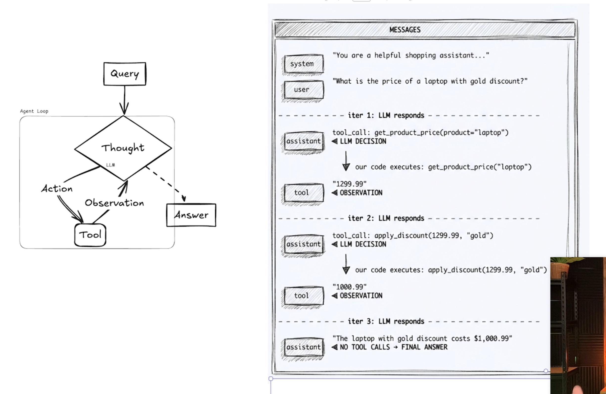

# 05. The ReACT Architecture 🤖

*Topic: Agents Under The Hood*

## 🎯 What You Will Learn
* The history and theory behind the **ReACT** (Reason + Act) algorithm.
* The anatomy of an Agent Loop: **Thought -> Action -> Observation**.
* How the "Agent Scratchpad" acts as the state memory for the loop.
* Setting up local, open-weights LLMs using **Ollama** (`qwen` model).
* The Roadmap: Peeling back LangChain's abstractions from "Magic" (Layer 0) to "Raw Regex" (Layer 3).

## 📦 Dependency Setup
We are adding formatting tools (`black`, `isort`) and local LLM support (`langchain-ollama`). Run this in your terminal:
```bash
uv add langchain langchain-ollama langchain-openai python-dotenv black isort
```

---

## 1. Core Architectural Concepts

### The ReACT Algorithm (Reason + Act)
First published in a 2023 Princeton/Google research paper, ReACT is the foundational algorithm powering tools like Devin, GitHub Copilot Workspace, and advanced AI agents.

An LLM by itself can only generate text. It cannot *do* things. ReACT solves this by forcing the LLM into a strict loop where it must **Reason** about what to do next, **Act** by requesting a specific tool, and then wait for an **Observation** (the result of the tool) before thinking again.
#### A. Core Definition
ReACT is an agent execution framework that combines **chain-of-thought reasoning** with **action execution**. Traditional LLM applications are linear and passive—they receive an input and immediately guess an output. ReACT solves this limitation by wrapping the LLM inside an orchestrating state machine loop. 

Instead of guessing an answer, the model is forced to alternate between a hidden reasoning space (**Thought**) and invoking external APIs or functions (**Action**) to retrieve hard facts, evaluating the results (**Observation**) before making its next decision.

#### B. The Conditional Loop Mechanics
The heart of the ReACT algorithm is a non-linear, branching decision matrix execution. Every turn of the loop follows a strict three-phase cycle:

```text
               [ User Input Received ]
                          │
                          ▼
         ┌───►─── [ PHASE 1: THOUGHT ]
         │    (LLM analyzes the current state)
         │                │
         │                ▼
         │     Is a tool required to proceed?
         │         ├───► YES ───► [ PHASE 2: ACTION ]
         │         │               (LLM requests tool execution)
         │         │                            │
         │         │                            ▼
         │         │                   [ Runtime Execution ]
         │         │               (Python runs local function)
         │         │                            │
         │         │                            ▼
         │         │               [ PHASE 3: OBSERVATION ]
         │         │               (Data appended to Scratchpad)
         │         │                            │
         │         └────────────────────────────┘
         │
         └───► NO ───► [ FINAL RESPONSE ] ───► [ EXIT LOOP ]
                  (LLM builds complete answer)  (State fully resolved)

```

1. **Phase 1: Thought (State Evaluation)**
The loop begins by feeding the LLM the entire conversation history along with a dedicated memory workspace called the **Agent Scratchpad**. The LLM reads the state and evaluates its current knowledge base. It explicitly answers an internal conditional check: *"Do I have 100% of the factual data required to solve this problem right now?"*
2. **Phase 2: The Conditional Branching Decision**
Based on the evaluation in Phase 1, the LLM branches down one of two executing paths:
* **Branch A (Incomplete Context / Tool Execution):** If the model is missing concrete context (e.g., live database records, math evaluations, external web data), it *cannot* proceed to an answer. It generates a structured **Action** command payload. This payload explicitly specifies the targeted tool name and the exact data arguments required (e.g., `tool_call: get_product_price(product="laptop")`).
* **Branch B (Complete Context / Termination):** If the model verifies that all necessary observations have been collected and compiled in its memory scratchpad, it bypasses all tool paths. It synthesizes the final text output for the user, triggers a termination flag, and cleanly **exits the execution loop**.


3. **Phase 3: Observation (Context Synthesis)**
When Branch A is taken, the LLM temporarily pauses execution and returns control to the native hosting runtime (your Python or C# application code). The runtime parses the model's action request, executes the corresponding code function locally, and captures the raw text output. This output is labeled as an **Observation**. The runtime appends this observation to the Agent Scratchpad and immediately forces the loop back to Phase 1.

#### C. Architectural Significance

Because large language models are fundamentally stateless, they do not naturally remember past operations within an agent cycle. The ReACT paradigm overcomes this limitation via the **Agent Scratchpad**. By appending every single thought, chosen tool call, and corresponding tool output back into the system prompt sequentially, the next loop's "Thought" phase is statistically conditioned on the entire history of actions. This creates a functional, highly predictable state machine.

### Core Conceptual Diagram: ReAct Logic

* **Thought:** The LLM analyzes the current state and reasons about what to do.
* **Action:** The LLM outputs a command to execute a specific tool (or returns a final answer).
* **Observation:** Your backend application code executes the tool and returns the raw result back to the LLM.

### C#/Java Analogy: The State Machine

* **Traditional Script:** Linear execution. `Step 1 -> Step 2 -> Step 3`.
* **ReACT Agent:** A **State Machine** wrapped in a `while(!state.IsFinished)` loop.
* The **LLM** acts as the `CpuContext`. It analyzes the current `State` (Thought) and returns a `Command` (Action).
* Your **Python/C# Code** is the runtime. It executes the C# method, appends the return value (Observation) to the `State` history, and loops back to feed the new `State` to the LLM.


---

## 2. Component Overview: The E-Commerce Agent

Now let's apply that theoretical loop to actual code in this section. We are building an e-commerce bot to answer: *"What is the price of a laptop with the gold discount?"*

To prove how agents work, we give the agent two distinct tools (C# Interfaces):

1. `get_product_price(product)` -> Returns the base price of the item.
2. `apply_discount(price, tier)` -> Returns the final price after applying a Bronze, Silver, or Gold discount.

### The ReACT Loop: Data Flow Walkthrough

The ReAct framework relies on appending every action and observation to the LLM's memory (the "Scratchpad") so it can reason about the next step. Here is exactly what happens over the network in each iteration of the loop for our laptop scenario.

**Iteration 1: Understanding the Need for Context**

* **Input State:** * System: "You are a helpful shopping assistant..."
* User: "What is the price of a laptop with gold discount?"


* **Thought (LLM):** "The user wants a discounted price. First, I need to know the base price of a laptop. I have a tool called `get_product_price`."
* **Action (LLM):** `tool_call: get_product_price(product="laptop")`
* **Observation (Python):** Your Python backend intercepts this JSON payload, executes the database query (C# Analogy: `IProductService.GetBasePrice("laptop")`), and returns `Observation: "1299.99"`.

**Iteration 2: Incorporating Previous Knowledge**

* **Input State:** User Query + Iter 1 History (The LLM now knows the laptop is 1299.99).
* **Thought (LLM):** "Okay, the laptop is $1299.99. Now I need to apply the 'gold' discount. I have a tool called `apply_discount`."
* **Action (LLM):** `tool_call: apply_discount(base_price=1299.99, tier="gold")`
* **Observation (Python):** Your Python code calculates the discount (C# Analogy: `IDiscountService.CalculateFinalPrice(1299.99, "gold")`) and returns `Observation: "1000.99"`.

**Iteration 3: Delivering the Final Result**

* **Input State:** User Query + Iter 1 History + Iter 2 History.
* **Thought (LLM):** "The final discounted price is $1000.99. I have all the information required. I do not need to make any more tool calls."
* **Action (LLM):** `FINAL ANSWER: "The laptop with gold discount costs $1,000.99."`
* **Loop Ends:** The `while` loop terminates and the answer is yielded to the user.

---

## 🧠 3. The Abstraction Layers Roadmap

To give us the deepest possible understanding of AI Agents, we'll work backward through the abstraction layers:

* **Layer 0 (The LangChain Magic):** Using `create_agent()`. You pass tools, it works, but it's a black box.
* **Layer 1 (LangChain Primitives):** We write the `while` loop ourselves, but use LangChain's `bind_tools` and `ToolMessage` objects to handle the complex formatting.
* **Layer 2 (Raw Function Calling):** We write the raw JSON schemas for the tools without LangChain, sending pure API requests to the LLM.
* **Layer 3 (Pure ReACT / No Function Calling):** We go back to 2023. No JSON schemas. We force the LLM to output text formatted exactly like `Action: ToolName`. We use **Regular Expressions (Regex)** in Python to parse the string, run the tool, and feed it back.

---

## 💻 4. Environment Setup (Ollama & Git)

### A. Code Repository Sync
If you are following along with a reference repo, checkout the starting branch for this section:
```bash
git checkout -b project/agents-under-the-hood <commit-hash>
```

### B. Ollama (Local LLM Engine)
* **What it is:** A lightweight framework that allows you to run large language models directly on your local CPU/GPU without paying OpenAI API fees.
* **C# Analogy:** Think of Ollama as **Docker Desktop for LLMs**. You "pull" an image (the model weights) and "run" it, exposing a local REST API (`localhost:11434`) that LangChain can talk to.

To run the local models, install Ollama and run:
```bash
# 1. Download the Qwen model (lightweight and supports tool calling)
ollama pull qwen2.5:1.5b

# 2. Test it in the CLI
ollama run qwen2.5:1.5b
# Type "Hi" to verify it responds, then type "/bye" to exit.

# 3. Start the Local Server
ollama serve
```
*(Leave the `ollama serve` terminal window open. Your Python code will now route its API requests to this local server instead of OpenAI).*

---

## 5. Quick Reference Dictionary

| Concept | Definition | OOP Equivalent |
| --- | --- | --- |
| **ReACT** | Reason + Act. The theoretical algorithm for agent loops. | A State Machine inside a `while` loop. |
| **Thought** | The LLM's internal reasoning about what to do next. | CPU evaluating the `CurrentState`. |
| **Action** | The LLM deciding to invoke a specific tool. | Emitting an `ICommand` interface. |
| **Observation** | The raw string result returned by the executed tool. | The return value of the executed C# method. |
| **Scratchpad** | The running history of all Thoughts, Actions, and Observations appended to the prompt. | The `List<StateHistory>` object. |

---

## ⚠️ Production Notes (What Breaks & How to Fix It)

* **Context Window Exhaustion:** The "Agent Scratchpad" grows with every loop iteration. If your agent gets stuck in a loop of calling tools incorrectly, the scratchpad will eventually exceed the LLM's token limit, causing an API crash.
* **The Fix:** Implement a strict `max_iterations` counter (e.g., force quit if the loop runs more than 5 times).
* **Local Model Limitations (Ollama):** Lightweight models like Qwen 1.5B are fast, but they are not GPT-4o. They might occasionally hallucinate the JSON arguments or forget to include required tool parameters.
* **The Fix:** Your Python code must include `try/catch` blocks around tool execution. If a tool fails, you must catch the error and feed it *back* to the LLM as an Observation (e.g., `"Observation: Error - missing argument 'tier'."`) so the LLM can correct its mistake in the next loop.

---

## 6. Interview Q&A Anchors

**Q: Explain the ReACT algorithm in the context of AI Agents.**
> **A:** ReACT stands for Reason and Act. It is an iterative loop where the LLM is prompted to first analyze the current state (Thought), choose a specific predefined function to execute along with its arguments (Action), and wait. The application code then executes that function and returns the result (Observation) back to the LLM. This loop continues until the LLM determines it has enough information to formulate a final response to the user.

**Q: How does the LLM "remember" what tools it has already called during an execution loop?**
> **A:** Through the Agent Scratchpad. Because LLMs are inherently stateless, the orchestrating framework (like LangChain or custom Python code) must append the history of all previous Thoughts, Actions, and Observations to the system prompt on every single iteration of the loop.

**Q: What is the benefit of testing Agents locally with Ollama instead of OpenAI?**
> **A:** Cost and privacy. Agent loops are heavily iterative; a single complex user request might result in 10-15 API calls as the agent reasons and acts. Using a local open-weights model via Ollama during development prevents racking up massive token charges on OpenAI, while keeping proprietary data entirely on the local machine.

