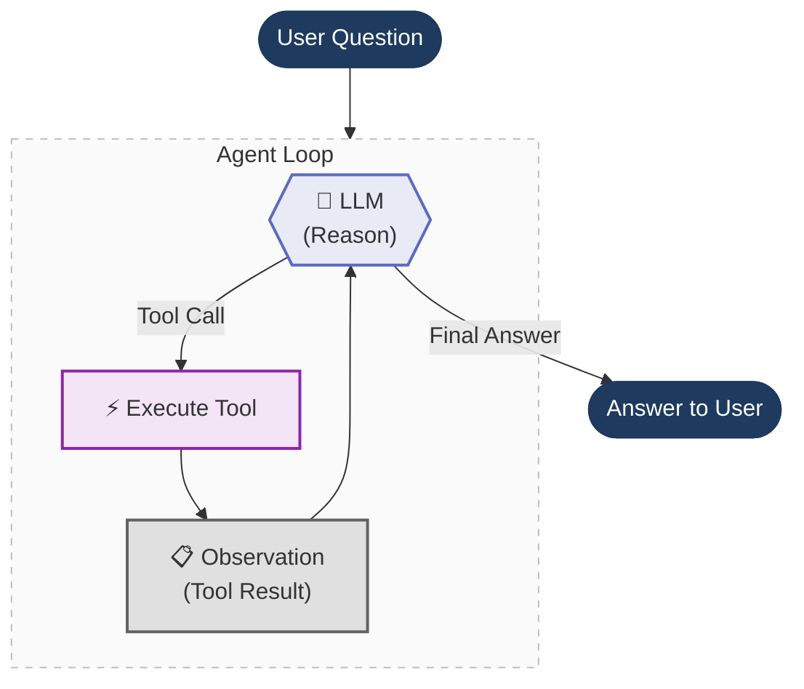

# 06. Agents Under the Hood

Peeling the layers of abstraction from LangChain down to raw prompt engineering.

*Topic: Agents Under The Hood - LangChain Tool Calling*

## What is this section about?

This section peels back LangChain's abstractions to reveal the **ReAct loop** underneath -- the repeating cycle where an LLM reasons, calls a tool, observes the result, and repeats until it has a final answer. We build it three times, removing one layer of abstraction each time.

*(Note: "Agent loop" is an informal practitioner term. The formal academic concept is **ReAct** (Reason + Act) from [Yao et al. 2022](https://arxiv.org/abs/2210.03629). LangChain's implementation is called `AgentExecutor`.)*

---

## Key Definitions (Interview-Ready)

Use these as your opening sentence when asked "What is X?" in an interview:

| Term | Quick Recall (say this first) | Full Definition |
|------|------|------------|
| **AI Agent** | "LLM + tools + loop" | A software system that uses an LLM as its reasoning engine to autonomously decide which actions to take, execute those actions via tools, and iterate until a goal is achieved. |
| **ReAct** | "Think, act, observe, repeat" | An agent architecture (Yao et al. 2022) that interleaves **Reasoning** (chain-of-thought) with **Acting** (tool execution), forcing the LLM to think before it acts and observe before it thinks again. |
| **Agent Loop** | "Send, call, append, repeat" | The runtime loop that repeatedly sends context to the LLM, receives a tool call or final answer, executes the tool, appends the result, and loops -- implementing the ReAct cycle in code. |
| **Agent Scratchpad** | "History grows each loop" | The growing message history (or string) that accumulates all previous Thoughts, Actions, and Observations, re-sent to the LLM on every iteration because LLMs are stateless. |
| **Function Calling** | "LLM outputs JSON, not text" | A fine-tuned LLM capability (introduced June 2023 by OpenAI) where the model outputs structured JSON specifying a function name and arguments, replacing fragile text-based tool invocation. |
| **Tool** | "Code the LLM can't run itself" | Any external function (API call, database query, calculation) that the LLM can request to execute but cannot run itself -- the application executes it and returns the result. |
| **AgentExecutor** | "LangChain's built-in loop" | LangChain's built-in implementation of the ReAct loop -- a Python class that handles the invoke-parse-execute-observe cycle so you don't write the loop manually. |
| **`@tool` decorator** | "Reflection to JSON schema" | LangChain's annotation that uses reflection to auto-generate a JSON schema from a Python function's type hints and docstring, making it callable by the LLM. |
| **`bind_tools()`** | "Attach schemas to the request" | Attaches tool JSON schemas to the LLM's HTTP request payload, telling the model which functions it's allowed to call -- does not execute anything itself. |
| **`init_chat_model()`** | "Factory -- swap provider with one string" | A factory function that instantiates the correct LLM class based on a provider string, enabling provider-agnostic code (swap "ollama:qwen3" to "openai:gpt-4o" without code changes). |
| **`ToolMessage`** | "Result + call_id back to LLM" | The message type used to return a tool's execution result back to the LLM, tagged with the original `tool_call_id` so the model can match the result to its request. |
| **Circuit Breaker** | "Cap the loop, prevent infinite calls" | A capped `for` loop that prevents infinite agent execution if the LLM gets stuck in a tool-calling loop -- protects against runaway API costs. |

## What You Will Learn
* The "Big Idea": Peeling back abstractions from Framework Magic down to Raw Regex.
* How to setup the environment and local Ollama instance for this module.
* How the `@tool` decorator uses reflection to auto-generate JSON schemas.
* How to manually build an Agent `while` loop (replacing the `AgentExecutor` black box).
* The Factory Pattern: Why we use `init_chat_model()` instead of `ChatOllama()`.

---

## 📦 Dependency Setup
Run this exact command in your terminal using `uv`:
```bash
uv add langchain langchain-ollama langchain-openai python-dotenv black isort
```

**2. Start the Local LLM:**
We are using `qwen3:1.7b` because it is lightweight but supports structured tool calling.

```bash
# Download the model (only needed once)
ollama pull qwen3:1.7b

# Ensure the Ollama server is running in the background
ollama serve

```

---
## Layers

Every AI agent — whether built with LangChain, LlamaIndex, CrewAI, or from scratch — follows the same core loop. We build it three times, each time peeling off a layer:

1. **Start with LangChain** — this is how you'd normally build an agent. `@tool`, `bind_tools()`, `init_chat_model()`. It just works. But what's actually happening underneath?
2. **Peel off LangChain** — build the same agent from scratch using only the Ollama SDK. Now you see what LangChain was doing for you: hand-written JSON schemas, manual message routing, raw tool dispatch.
3. **Peel off function calling** — go even deeper. Modern LLMs have built-in function calling, but that's a recent feature (June 2023). Before that, agents worked through pure prompt engineering: the **ReAct pattern**. We strip away function calling entirely and build it with just a prompt template and regex.

```
┌─────────────────────────────────────────────-┐
│  File 1: LangChain                           │  ← @tool, bind_tools(), ToolMessage
│  ┌────────────────────────────────────────┐  │
│  │  File 2: Raw Function Calling          │  │  ← Hand-written JSON schemas, ollama.chat()
│  │  ┌─────────────────────────────────┐   │  │
│  │  │  File 3: Raw ReAct Prompt       │   │  │  ← Prompt template, regex, scratchpad
│  │  └─────────────────────────────────┘   │  │
│  └────────────────────────────────────────┘  │
└─────────────────────────────────────────────-┘
```

Each file is self-contained and runnable on its own.

---

## The Agent Loop

At their core, all three implementations share the same loop — the agent reasons, picks a tool, executes it, observes the result, and repeats until it has a final answer:



What changes across the three files is **how** each step is implemented:

| Step | File 1 (LangChain) | File 2 (Raw Function Calling) | File 3 (Raw ReAct) |
|------|------|------|------|
| **Reason** | LLM returns structured `tool_calls` | LLM returns structured `tool_calls` | LLM outputs text: `Thought: ... Action: ...` |
| **Parse** | `ai_message.tool_calls[0]` | `message.tool_calls[0].function` | Regex: `r"Action:\s*(.+)"` |
| **Execute** | `tool.invoke(args)` | `tools[name](**args)` | `tools[name](*args)` |
| **Observe** | Append `ToolMessage` | Append `{"role": "tool"}` dict | Append to scratchpad string |
| **Finish** | No tool calls in response | No tool calls in response | `"Final Answer:"` found in text |

---

## Implementations

### 1. LangChain Tool Calling
**File:** [`01_agent_loop_langchain_tool_calling.py`](./src/01_agent_loop_langchain_tool_calling.py)

We start here — this is how you'd normally build an agent. Reading through the code top to bottom:

- **Imports & config** — LangChain, LangSmith, model name
- **Tools** — two plain Python functions decorated with `@tool`. LangChain auto-generates the JSON schema from the function signature and docstring. No manual schema writing needed.
- **Agent loop** — initialize the LLM with `init_chat_model(f"ollama:{MODEL}")`, attach tools with `bind_tools()`, then loop: invoke the LLM, check if it returned tool calls, execute the tool, append a `ToolMessage`, repeat.

**What LangChain gives you:**
- `@tool` → auto-generates JSON tool schema from your function
- `init_chat_model()` → swap providers by changing one string (`"ollama:qwen3"` → `"openai:gpt-4o"`)
- `bind_tools()` → attaches tool definitions to the LLM
- `ToolMessage` → handles the tool result format
- Typed message objects (`SystemMessage`, `HumanMessage`) instead of raw dicts

It just works. But what's actually happening underneath all these abstractions?

**Stack:** `langchain`, `langsmith` for tracing

---

### 2. Raw Function Calling (No LangChain)
**File:** [`02_agent_loop_raw_function_calling.py`](./src/02_agent_loop_raw_function_calling.py)

Now we peel off LangChain and build the exact same agent using only the `ollama` Python SDK. Compare with file 1 side-by-side to see what LangChain was doing for you. Reading top to bottom:

- **Imports & config** — just `ollama` and `langsmith`. No LangChain.
- **Tools** — the same two Python functions, but now they're just plain functions (no `@tool` decorator).
- **Tool registry** — a simple dict mapping tool names to functions. In file 1, LangChain built this for you with `{t.name: t for t in tools}`.
- **JSON tool schemas** — hand-written JSON dictionaries describing each tool's name, description, and parameters. This is what `@tool` auto-generated in file 1. You can see how verbose it is.
- **Agent loop** — call `ollama.chat()` directly, pass the JSON schemas as `tools=`, check `response.message.tool_calls`, dispatch with `tools[name](**args)`, append raw `{"role": "tool"}` dicts to the message history.

**What you see without LangChain:**
- Tool schemas are ~30 lines of JSON you have to write by hand
- Messages are plain dicts (`{"role": "system", "content": "..."}`) instead of typed objects
- Tool results are appended as `{"role": "tool", "content": result}` instead of `ToolMessage`
- Switching to a different provider (OpenAI, Anthropic) means rewriting the SDK calls, message format, and tool schema format

**Stack:** `ollama` SDK, `langsmith` for tracing

---

### 3. Raw ReAct Prompt (No Function Calling, No LangChain)
**File:** [`03_raw_react_prompt.py`](./src/03_raw_react_prompt.py)

Now we peel off function calling itself. This is how agents worked **before LLMs had built-in tool calling** (pre-June 2023). No structured `tool_calls` in the API response — the LLM just outputs raw text, and we parse it with regex. Reading top to bottom:

- **Imports & config** — `ollama`, `re` (regex), `langsmith`. No LangChain, no function calling.
- **Tools** — same two Python functions, same tool registry dict.
- **ReAct prompt template** — this is the key. Instead of passing JSON tool schemas to the API, we describe the tools *inside the prompt itself* as plain text. The prompt also instructs the LLM to follow a strict format: `Thought → Action → Action Input → Observation`. This is the original **ReAct pattern** from the [Yao et al. 2022 paper](https://arxiv.org/abs/2210.03629).
- **Agent loop** — completely different from files 1 and 2:
  - Send the full prompt (template + accumulated scratchpad) as a single user message
  - Use `stop=["\nObservation"]` so the LLM stops before hallucinating the tool result — this lets us inject the real result
  - Parse the LLM's raw text output with regex to extract `Action:` and `Action Input:`
  - Execute the tool, then append the full cycle (`Thought/Action/Observation`) to the scratchpad string
  - Check for `"Final Answer:"` in the text to know when the agent is done

**What's different without function calling:**
- No JSON schemas — tools are described as plain text in the prompt
- No structured `tool_calls` — the LLM outputs text like `Action: get_product_price`
- No message history — instead, a **scratchpad** string accumulates the full reasoning chain
- Parsing is fragile — regex can break if the LLM doesn't follow the format exactly
- The `stop` parameter is critical — without it, the LLM would hallucinate tool results

**Stack:** `ollama` SDK, `re` (regex), `langsmith` for tracing

---

## The Same Agent, Three Ways

All three files answer the same question with the same tools:

> **"What is the price of a laptop after applying a gold discount?"**

**Tools:**
- `get_product_price(product)` — looks up prices from a catalog (laptop: $1,299.99)
- `apply_discount(price, discount_tier)` — applies a named discount tier (gold: 23% off)

**Expected flow:**
1. Agent calls `get_product_price("laptop")` → gets `1299.99`
2. Agent calls `apply_discount(1299.99, "gold")` → gets `1000.99`
3. Agent returns the final answer

The discount tiers use non-obvious percentages (bronze: 5%, silver: 12%, gold: 23%) so the LLM can't guess the result — it *must* use the tools.

---

## 2. The Big Idea (The Abstraction Hierarchy)

Every AI agent follows the same core ReAct loop: **Reason -> Execute Tool -> Observe -> Repeat**. What changes is *how much of that loop you have to write yourself*. This breaks down into three files. We are starting with File 1.

| Step | File 1 (LangChain Primitives) | File 2 (Raw Function Calling) | File 3 (Raw ReAct / Regex) |
| --- | --- | --- | --- |
| **Reason** | LLM returns structured `tool_calls` | LLM returns structured `tool_calls` | LLM outputs text: `Thought: ... Action: ...` |
| **Parse** | `ai_message.tool_calls[0]` | `message.tool_calls[0].function` | Regex: `r"Action:\s*(.+)"` |
| **Execute** | `tool.invoke(args)` | `tools[name](**args)` | `tools[name](*args)` |
| **Observe** | Append `ToolMessage` object | Append raw `{"role": "tool"}` dict | Append to raw scratchpad string |
| **Finish** | No tool calls in response | No tool calls in response | `"Final Answer:"` found in text |

---

## 3. Component Deep Dive

### A. The `@tool` Decorator (Reflection & Schema Generation)

In standard Python, a function is just a block of code. But LLMs cannot read Python. They require strict JSON schemas (like a Swagger/OpenAPI spec) to understand what tools exist.
**C#/Java Analogy:** Think of `@tool` exactly like C# `[Route]` or `[Function]` attributes. At runtime, LangChain uses reflection to inspect the function's signature and docstring, automatically compiling it into a JSON payload to send to the LLM.

### B. Binding Tools to the LLM (`bind_tools`)

**OOP Concept:** **Dependency Injection / Protocol Binding.** `bind_tools` does not execute anything. It simply modifies the HTTP client. It tells the LLM, *"When I send you a prompt, I am also attaching this list of available interfaces you are allowed to call."*

### C. The Tool Execution (Service Locator)

When the LLM returns a `tool_name` string, we must execute the corresponding function.

```python
tool_to_use = tools_dict.get(tool_name) 
observation = tool_to_use.invoke(tool_args)

```

**C#/Java Analogy:** This is a classic **Service Locator Pattern**. The LLM returns a string containing the name of the method. We look up that string in our registry (`tools_dict`), grab the actual function pointer, and invoke it using the LLM's arguments.

### D. The ToolMessage (State Reconciliation)

This is the critical handoff. We append the result of our local code execution to the `messages` array. We **must** wrap it in a `ToolMessage` and pass the exact `tool_call_id` that the LLM originally generated. This acts as the cryptographic "receipt" that proves to the LLM that we executed the exact tool it asked for.

---

## ⚠️ Production Notes (What Breaks & How to Fix It)

* **Tool ID Mismatches:** When an LLM requests a tool, it generates a unique ID (e.g., `call_abc123`). When you construct the `ToolMessage` to return the observation, the `tool_call_id` must match perfectly. If you forget this ID, or map it incorrectly, the LLM API will immediately throw an HTTP 400 Bad Request error because its state history is corrupted.
* **Infinite Loops:** Because LLMs are non-deterministic, they can get confused and call the same tool endlessly. You must **never** use a `while True:` loop in production AI. Always use a capped `for` loop (`MAX_ITERATIONS`) to act as a circuit breaker and prevent infinite API billing.
* **Stringification of Output:** The `ToolMessage(content=str(observation))` requires a string. If your local Python function returns a complex object, a C# `struct`, or a nested Dictionary, you must serialize it to JSON/String before appending it to the message history.

---

## 6. Interview Q&A Anchors

**Q: What is the difference between using `init_chat_model()` versus directly instantiating `ChatOpenAI()` or `ChatOllama()`?**

> **A:** This is a classic implementation of the **Factory Pattern** and the **Dependency Inversion Principle**.
> * If you hardcode `llm = ChatOpenAI()`, your code is tightly coupled to OpenAI. If you want to switch to Anthropic, you have to rewrite your import statements and your instantiation logic.
> * `init_chat_model("gpt-4o", model_provider="openai")` acts as a Factory. It allows you to inject the model name and provider dynamically (usually from an environment variable). LangChain reads the string and instantiates the correct underlying class for you, making your application completely model-agnostic without changing any core logic.
> 
> 

**Q: Why do we have to continuously pass the entire `messages` history array back to the LLM on every iteration of the loop?**

> **A:** Because LLM APIs are fundamentally **stateless** REST endpoints. The LLM has no internal memory of the previous loop iteration. We must maintain the "Agent Scratchpad" (the growing history of Human, AI, and Tool messages) in our application's local memory and inject the entire payload on every call.

**Q: In LangChain, what is the exact purpose of the `ToolMessage` class?**

> **A:** `ToolMessage` is the state-reconciliation object used in the ReAct loop. When the application executes the local code, the raw result must be converted to a string, wrapped in a `ToolMessage`, and tagged with the LLM's original `tool_call_id`. This allows the LLM to explicitly link its previous "Action" request to the application's "Observation" response.

**Q: What happens if an LLM decides it needs to call three different tools at the exact same time?**

> **A:** Modern models support **Parallel Function Calling**. The `ai_message.tool_calls` property is actually a List/Array. In a production-grade loop, instead of just grabbing `tool_calls[0]`, you would iterate over the entire array, execute all requested tools (potentially asynchronously using `asyncio` or `Task.WhenAll` in C#), and append a distinct `ToolMessage` for *each* tool call before returning the history to the LLM.

**Q: Why do we write a `for` loop with a `MAX_ITERATIONS` constant instead of a `while` loop for our Agent?**

> **A:** As a strict safeguard against infinite execution loops. If the LLM hallucinates the wrong parameters, the tool might return an error string. The LLM might then stubbornly retry the exact same bad parameters indefinitely. Capping the loop ensures the execution safely aborts, protecting system resources and API budgets.

**Q: How does LangChain translate your backend code into something the LLM can trigger?**

> **A:** Through reflection and schema generation. By using the `@tool` decorator, LangChain parses the Python function's type hints and docstrings to generate an OpenAPI/JSON Schema. We inject this schema into the API payload via `bind_tools()`. The LLM reads this JSON schema, and when it requires the tool, it returns a matching JSON object requesting execution.