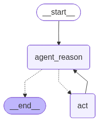

# 16. Introduction to LangGraph — Why Graphs, Flow Engineering, and Core Components

> **Context:** This is the first theory module on LangGraph. It answers *why* LangGraph exists, positions it on the autonomy spectrum, introduces graph/state machine fundamentals, and explains the core components you'll use in every LangGraph program.

---

## Table of Contents

| # | Section | What You'll Learn |
|---|---------|-------------------|
| 1 | [What Is LangGraph?](#1-what-is-langgraph) | The one-sentence definition and how it relates to LangChain |
| 2 | [The Autonomy Spectrum](#2-the-autonomy-spectrum) | From deterministic code to autonomous agents — where LangGraph sits |
| 3 | [LangChain vs LangGraph](#3-langchain-vs-langgraph) | What LangChain does well, where it breaks down, and what LangGraph adds |
| 4 | [What Is an Agent?](#4-what-is-an-agent) | The practical definition: LLM-driven control flow with cycles |
| 5 | [The ReAct Problem](#5-the-react-problem) | Why unconstrained agents fail in production |
| 6 | [Graphs as a Data Structure](#6-graphs-as-a-data-structure) | Nodes, edges, vertices — the math behind the framework |
| 7 | [State Machines](#7-state-machines) | States + transitions = controllable computation |
| 8 | [Flow Engineering](#8-flow-engineering) | The philosophy: developers define the flow, LLMs execute within it |
| 9 | [LangGraph Core Components](#9-langgraph-core-components) | Nodes, edges, conditional edges, state, START, END |
| 10 | [Project: ReAct Agent with Function Calling](#10-project-react-agent-with-function-calling) | The first real LangGraph implementation |
| 11 | [The Evolution of ReAct Agents — Full Recap](#11-the-evolution-of-react-agents--full-recap) | From ReAct prompt → function calling → LangGraph → create_agent |
| 12 | [Interview Q&A Anchors](#interview-qa-anchors) | Quick-fire answers for interviews |

---

## Key Definitions

| Term | Quick Recall | Full Definition |
|------|-------------|----------------|
| **LangGraph** | Graph-based agent orchestration framework | A library built on top of LangChain that lets you define agentic applications as state machines with nodes, edges, and cycles — giving developers full control of the flow while LLMs decide *within* that flow. |
| **Flow Engineering** | Developers define flow, LLMs execute in it | A systematic approach to AI development where developers architect the control flow (state machine) and LLMs are scoped to make decisions *within* that predefined flow — not to create their own plans. |
| **Autonomy Spectrum** | From deterministic → fully autonomous | A mental model showing levels of LLM freedom: deterministic code → single LLM call → chains → routers → agents → autonomous agents. LangGraph occupies the "controlled agent" zone. |
| **Cycle** | A loop back to a previous node | The ability for execution to return to an earlier node — impossible in LangChain chains/LCEL, essential for agents (think → act → observe → think again). |
| **Node** | A Python function in the graph | Any Python function that receives the current state, does work (LLM call, API call, pure logic), and returns a state update. |
| **Edge** | A fixed connection between nodes | A static wire: "after node A, always go to node B." |
| **Conditional Edge** | LLM-decided routing | A dynamic wire: "after node A, look at state and decide — go to B or C?" This is where the LLM's reasoning plugs into the flow. |
| **State** | Shared dictionary across all nodes | A dictionary accessible by every node and edge during graph execution — stores messages, intermediate results, flags. Can be persisted. |
| **Graph** | Nodes + Edges | A mathematical structure of vertices (nodes) connected by edges. LangGraph uses directed graphs (edges have direction) with cycles (loops). |
| **State Machine** | States + transitions | A computation model where you define discrete states and the rules for transitioning between them. Graphs visualize state machines naturally. |

---

## 1. What Is LangGraph?

From the [official LangGraph announcement](https://www.langchain.com/blog/langgraph):

> LangGraph is a library for building **language agents as graphs**.

The entire flow of your agent — what it can do, in what order, with what branching — is expressed as a **graph with cycles**. That's the key differentiator from LangChain's LCEL, which only supports **acyclic** (one-directional) flows.

```
LangChain LCEL:    A → B → C → D          (no going back)
LangGraph:         A → B → C → B → C → D  (cycles allowed!)
```

**Why cycles matter:** An agent needs to think → act → observe the result → think again. That "think again" requires going *back* to a previous node. Without cycles, you can't build a proper agent loop.

---

## 2. The Autonomy Spectrum

There's a spectrum from full developer control to full LLM autonomy:

```
MORE CONTROL ←──────────────────────────────────────────────→ MORE AUTONOMY
(more reliable)                                              (more flexible)

┌──────────────┬───────────────┬──────────┬──────────┬────────────────────┐
│ Deterministic│ Single LLM    │  Chains  │ Routers  │ Autonomous Agents  │
│ Code         │ Call          │          │          │ (AutoGPT, BabyAGI) │
├──────────────┼───────────────┼──────────┼──────────┼────────────────────┤
│ You write    │ You write the │ Multiple │ LLM      │ LLM creates its    │
│ everything.  │ flow, LLM     │ LLM calls│ decides  │ own tasks, writes  │
│ No LLM.     │ generates ONE │ chained  │ which    │ code, executes it. │
│ Fully        │ output in the │ together │ branch   │ No human control.  │
│ predictable. │ pipeline.     │ (RAG).   │ to take. │ NOT production-    │
│              │               │          │ No       │ ready.             │
│              │               │          │ cycles.  │                    │
└──────────────┴───────────────┴──────────┴──────────┴────────────────────┘
												 ↑
										  ┌──────┴──────┐
										  │  LANGGRAPH  │
										  │ Lives HERE  │
										  │ (controlled │
										  │  agents     │
										  │  with       │
										  │  cycles)    │
										  └─────────────┘
```

### What Each Level Looks Like in Code

**Deterministic code** — no LLM at all:
```python
# You control everything. Predictable but inflexible.
def process_order(order):
	validated = validate(order)
	total = calculate_total(validated)
	return send_confirmation(total)
```

**Single LLM call** — LLM generates one output in your flow:
```python
# You control the flow. LLM handles one generation step.
alert_data = fetch_alert()
explanation = llm.invoke(f"Explain this security alert: {alert_data}")
send_to_dashboard(explanation)
```

**Chain** — multiple LLM calls composed together (like RAG):
```python
# Each step feeds the next. Still no branching by the LLM.
question = "What is RAG?"
docs = retriever.invoke(question)          # Step 1: retrieve
answer = llm.invoke(f"{docs}\n{question}") # Step 2: generate
```

**Router** — LLM decides which branch (but NO cycles):
```python
# LLM picks a path, but can't loop back. LangChain can do this.
route = llm.invoke("Should I search the DB or the web?")
if route == "db":
	result = search_database(query)
else:
	result = search_web(query)
```

**LangGraph agent** — LLM decides the path AND can loop:
```python
# LLM picks a path AND can go back to "think again". THIS is LangGraph.
# Think → Act → Observe → Think again (cycle!)
```

**Autonomous agent** — LLM creates its own plan (NOT production-ready):
```python
# LLM invents tasks, writes code, executes it. Too unreliable.
# AutoGPT, BabyAGI, GPT-Engineer — impressive demos, not production.
```

### The Key Insight

> LangGraph gives you **one more dimension of freedom** over LangChain routers (cycles), while taking away **one dimension of freedom** from autonomous agents (you define the flow, not the LLM).

This is the sweet spot for production: **flexible enough** to handle complex tasks, **controlled enough** to be reliable.

---

## 3. LangChain vs LangGraph

| Aspect | LangChain (LCEL) | LangGraph |
|--------|-------------------|-----------|
| **Flow type** | Directed Acyclic Graph (DAG) — one direction only | Directed graph with **cycles** — can loop |
| **Branching** | Router chains (LLM picks a path) | Conditional edges (same concept, but with cycles) |
| **Looping** | Not supported (hacked with `while` loops in source code) | First-class citizen — edges can point backward |
| **State** | Passed through the chain sequentially | Shared state dictionary accessible by ALL nodes |
| **Persistence** | Manual (you implement it) | Built-in checkpointers (MemorySaver, PostgresSaver) |
| **Human-in-the-Loop** | Hard to implement | Built-in `interrupt_before` / `interrupt_after` |
| **Debugging** | LangSmith traces per chain | LangSmith + time travel + state inspection |
| **When to use** | Simple pipelines, RAG, linear workflows | Agents, iterative workflows, complex branching with loops |

**Important:** LangGraph is built **on top of** LangChain. It uses LangChain's chat models, tools, messages, and tracing. You're not choosing one or the other — you use both. LangGraph adds the **orchestration layer** that LangChain doesn't have.

> ℹ️ **Note:** "The ReAct algorithm has literally a while loop in the source code" — this is accurate. LangChain's `AgentExecutor` uses a Python `while` loop to simulate cycles. LangGraph replaces this hack with proper graph cycles.

---

## 4. What Is an Agent?

A working definition:

> An agent is essentially a **control flow where an LLM decides where to go**.

Three properties that make something an "agent":

1. **LLM-driven routing** — the LLM decides the next step (not hardcoded `if/else`)
2. **Tool use** — the LLM can invoke functions (APIs, databases, searches) via function calling
3. **Cycles** — the LLM can loop back (think → act → observe → think again)

```
┌─────────────────────────────────────────────────┐
│                 AGENT LOOP                       │
│                                                 │
│    ┌──────┐    ┌──────────┐    ┌────────────┐  │
│    │ LLM  │───▶│ Use tool │───▶│ Feed result│  │
│    │thinks│    │ (if      │    │ back to LLM│  │
│    └──┬───┘    │ needed)  │    └──────┬─────┘  │
│       │        └──────────┘           │         │
│       │                               │         │
│       │◀──────────────────────────────┘         │
│       │         (CYCLE!)                        │
│       │                                         │
│       ▼                                         │
│  ┌─────────┐                                    │
│  │ Return  │  (when LLM decides: no more tools) │
│  │ answer  │                                    │
│  └─────────┘                                    │
└─────────────────────────────────────────────────┘
```

### Agent vs Chain — The One Difference

| | Chain | Agent |
|---|---|---|
| **Direction** | Left → Right (one-way) | Can loop back |
| **Cycles** | ❌ Not possible | ✅ Core feature |
| **LLM role** | Generates output | Generates output AND decides control flow |

---

## 5. The ReAct Problem

The [ReAct paper](https://arxiv.org/abs/2210.03629) introduced the basic agent loop: **Reason + Act**. LangChain implemented it as `AgentExecutor`. But it has a critical flaw in production:

**Every permutation is allowed.** The LLM can call any tool, in any order, any number of times. This leads to:

```
❌ THE INFINITE LOOP PROBLEM:

	LLM: "I'll search the database..."
	Tool: returns result
	LLM: "I'll search the database again..."
	Tool: returns same result
	LLM: "I'll search the database again..."
	... (stuck forever)
```

**Why this happens:**
- Tool descriptions are ambiguous
- LLM is non-deterministic (statistical token prediction)
- LLM picks the wrong tool or wrong arguments
- LLM hallucinates tools that don't exist
- LLM can't "escape" the loop because it has full freedom

**The fundamental tradeoff:**

```
ReAct Agent:  Flexible ✅  but  Reliable ❌
Deterministic: Reliable ✅  but  Flexible ❌
LangGraph:    Flexible ✅  AND  Reliable ✅  ← sweet spot
```

**How LangGraph solves this:** You (the developer) define the graph structure. The LLM can only go where your edges allow. If you don't add an edge from node A back to node A, the LLM physically can't create an infinite loop there. You control the topology; the LLM operates within it.

---

## 6. Graphs as a Data Structure

A graph is a mathematical structure for representing **relationships**:

```
Formal definition:  G = (V, E)
  V = set of vertices (nodes)
  E = set of edges (pairs of vertices)
```

### Types of Graphs

| Type | Description | LangGraph uses? |
|------|-------------|-----------------|
| **Undirected** | Edges have no direction (A—B) | ❌ |
| **Directed** | Edges have direction (A→B) | ✅ |
| **Acyclic** | No loops possible (DAG) | ❌ (LangChain LCEL is this) |
| **Cyclic** | Loops allowed (A→B→A) | ✅ (this is LangGraph's power) |

### Real-World Graph Applications

Graph databases show up in many domains (for example, cybersecurity):

- **Social networks** — users are nodes, friendships are edges
- **Transportation** — cities are nodes, roads are edges
- **Cloud security** — assets (servers, databases) are nodes, connections are edges. "Is this web server internet-facing AND connected to a database?"
- **LangGraph** — processing steps are nodes, flow paths are edges

### C# Analogy

```csharp
// A graph in C# — nodes and edges as a data structure
public class Node<T>
{
	public T Value { get; set; }
	public List<Node<T>> Neighbors { get; set; } = new();
}

// LangGraph equivalent: each node is a function, neighbors are defined by edges
// graph.add_edge("node_a", "node_b")  ←  node_a.Neighbors.Add(node_b)
```

---

## 7. State Machines

A state machine is a **computation model** with:
- **States** — discrete conditions the system can be in
- **Transitions** — rules for moving between states

```
┌──────────────────────────────────────────────┐
│          VENDING MACHINE STATE MACHINE        │
│                                              │
│  [Idle] ──(insert coin)──▶ [Has Money]       │
│                             │                │
│                    (select item)             │
│                             │                │
│                             ▼                │
│                        [Dispensing]           │
│                             │                │
│                      (item dropped)          │
│                             │                │
│                             ▼                │
│                          [Idle] ← (cycle!)   │
└──────────────────────────────────────────────┘
```

**Key insight:** State machines can be **represented as graphs** — states are nodes, transitions are edges. This is exactly what LangGraph does:

| State Machine Term | Graph Term | LangGraph Term |
|-------------------|-----------|----------------|
| State | Node/Vertex | Node (Python function) |
| Transition | Edge | Edge / Conditional Edge |
| Current State | Active node | Which node is executing now |
| Shared Data | — | State dictionary |

---

## 8. Flow Engineering

Flow engineering is the **philosophy** behind LangGraph. It's a relatively new idea in the AI community:

> **Flow Engineering:** A systematic approach where developers architect the control flow (state machine) and LLMs operate *within* that flow — not creating their own plans.

### The Core Principle

| Who | Does What |
|-----|-----------|
| **Developer** | Defines the states, the edges, the graph topology. Controls WHAT steps exist. |
| **LLM** | Executes within a step (e.g., generate text, analyze data) OR decides WHICH step to go to next. But CANNOT invent new steps. |

### Why Autonomous Agents Fail

Projects like AutoGPT, BabyAGI, and GPT-Engineer let the LLM do **long-term planning** — inventing its own tasks, subtasks, and execution order. In practice:

- The LLM goes off-track because it's a statistical token predictor, not a planner
- It creates imaginary subtasks that don't make sense
- It can't recover when a subtask fails
- There's no human-defined guardrail to bring it back

**Flow engineering's answer:** Don't let the LLM plan. YOU plan. The LLM executes.

### Example: Tweet Writer Agent

```
┌────────────────────────────────────────────────────┐
│ FLOW ENGINEERING EXAMPLE: Tweet Writer              │
│ (Developer defines this graph structure)            │
│                                                    │
│   [Generate]──▶[Critique]──▶[Good enough?]        │
│       ▲                          │     │           │
│       │                         NO    YES          │
│       │                          │     │           │
│       └──────────────────────────┘     ▼           │
│         (cycle: try again)         [Publish]       │
└────────────────────────────────────────────────────┘

Developer decided: there WILL be a critique step.
Developer decided: there CAN be a retry cycle.
LLM decides: IS this tweet good enough? (within the flow)
LLM executes: generate the tweet, critique the tweet.
```

### A Prediction for AI Development Time Distribution

| Activity | % of Time | What It Means |
|----------|-----------|---------------|
| **Flow Engineering & Architecture** | 60% | Designing the state machine, defining nodes, deciding which steps exist |
| **Fine-tuning** | 35% | Making the model domain-specific for your tasks |
| **Prompt Engineering** | 5% | Writing the actual prompts (much less important than people think) |

> ⚠️ **Note:** This is a forward-looking prediction, not current industry consensus. Today prompt engineering still takes significant effort, but the trend is moving toward flow/architecture as the primary skill.

---

## 9. LangGraph Core Components

### The Three Building Blocks

Every LangGraph program is built from exactly three things:

| Component | What It Is | Role |
|-----------|-----------|------|
| **Nodes** | Python functions | Do the actual work (call LLMs, APIs, process data) |
| **Edges** | Fixed connections | "After node A, ALWAYS go to node B" |
| **Conditional Edges** | Dynamic routing | "After node A, LOOK AT STATE and decide — go to B or C?" |

### Nodes — Just Python Functions

A node is literally any Python function. The only rules:
1. It receives the **current state** as input
2. It returns a **dictionary** that updates the state

```python
# Node that calls an LLM — this is the most common type
def agent_node(state):
	"""Receives state, calls LLM, returns state update."""
	response = llm.invoke(state["messages"])
	return {"messages": [response]}  # ← updates the "messages" key in state

# Node that's pure Python — no LLM at all
def calculate_total(state):
	"""A deterministic node — just Python logic."""
	items = state["cart_items"]
	total = sum(item["price"] for item in items)
	return {"total": total}  # ← updates the "total" key in state

# Node that calls an external API
def search_database(state):
	"""Calls a real API — nothing to do with LLMs."""
	query = state["messages"][-1].content
	results = my_database.search(query)
	return {"search_results": results}
```

**Key point:** LangGraph doesn't care what's inside your node. It can be an LLM call, a database query, a math calculation, or even a `time.sleep()`. It's just a function.

### Edges — Fixed Wiring

```python
from langgraph.graph import StateGraph, START, END

graph = StateGraph(MyState)

# "After START, always go to agent"
graph.add_edge(START, "agent")

# "After tools, always go back to agent"
graph.add_edge("tools", "agent")
```

### Conditional Edges — LLM-Decided Routing

This is where the "agent" behavior comes from. The routing function inspects the state and returns the name of the next node:

```python
def should_continue(state):
	"""Inspect the state and decide where to go next."""
	last_message = state["messages"][-1]

	# If the LLM requested tool calls → go to tools node
	if last_message.tool_calls:
		return "tools"

	# Otherwise the LLM gave a final answer → done
	return END

# Wire it up: after "agent" node, call should_continue to decide
graph.add_conditional_edges("agent", should_continue)
```

### START and END — Built-in Nodes

| Node | Purpose | Does it do any work? |
|------|---------|---------------------|
| `START` | Entry point — where execution begins | No (just marks the beginning) |
| `END` | Exit point — where execution finishes | No (just marks the end) |

### State — The Shared Dictionary

The state is a dictionary that EVERY node can read and write. It's the "memory" of the graph:

```python
from langgraph.graph import MessagesState

# Simple state — just messages (most common)
class MyState(MessagesState):
	pass
	# Inherits: messages: list[AnyMessage]

# Complex state — custom fields
class OrderState(MessagesState):
	order_status: str        # Custom field
	total_amount: float      # Custom field
	preferred_language: str  # Custom field
```

**State properties:**
- **Shared** — every node and edge can access it
- **Updated by nodes** — each node returns `{key: value}` to update specific keys
- **Local by default** — exists only during graph execution (in-memory)
- **Persistable** — with a checkpointer, state survives between invocations

### Putting It All Together

```python
from langgraph.graph import StateGraph, MessagesState, START, END

# 1. Define state
class AgentState(MessagesState):
	pass

# 2. Define nodes (just Python functions)
def think(state):
	response = llm.invoke(state["messages"])
	return {"messages": [response]}

# 3. Build graph
graph = StateGraph(AgentState)
graph.add_node("think", think)                # Register node
graph.add_node("tools", ToolNode(tools))      # Register another node

# 4. Wire edges
graph.add_edge(START, "think")                # Start → think
graph.add_conditional_edges("think", router)  # think → tools or END
graph.add_edge("tools", "think")              # tools → think (THE CYCLE!)

# 5. Compile
app = graph.compile()

# 6. Run
result = app.invoke({"messages": [HumanMessage(content="Hello")]})
```

### Why "Why Not Airflow or NetworkX?"

A common objection: "I can build it with Airflow or NetworkX or another graph framework."

**Answer:** LangGraph is **opinionated for agentic applications**. It provides:

| Feature | Generic Graph Frameworks | LangGraph |
|---------|--------------------------|-----------|
| Conditional LLM-based routing | DIY | Built-in |
| Message state management | DIY | Built-in (`MessagesState`) |
| Checkpointing/persistence | DIY | One-line (`MemorySaver`, `PostgresSaver`) |
| Human-in-the-loop | DIY | Built-in (`interrupt_before`) |
| Time travel / state replay | DIY | Built-in (`get_state_history`) |
| LangSmith tracing | DIY | Automatic |
| Parallel node execution | Varies | Built-in |

You *could* build all of this with Airflow. But LangGraph gives you all of it out of the box because it's designed specifically for LLM-driven state machines.

---

## 10. Project: ReAct Agent with Function Calling

> Implementing the first real LangGraph program: a ReAct agent that uses function calling to answer questions requiring multiple tool invocations.

### What This Project Demonstrates

This is the **simplest possible LangGraph agent** and the pattern that 90% of production agents follow. It takes everything from the theory sections above and puts it into working code.

### The Graph (Visual)



### How It Works — Step by Step

```
User: "What is the temperature in Tokyo? List it and then triple it"

┌─────────────────────────────────────────────────────────────────────┐
│ ITERATION 1                                                         │
│   agent_reason: LLM thinks → "I need to search for Tokyo temp"     │
│   → AIMessage with tool_calls=[{name: 'tavily_search', args: ...}] │
│   should_continue: has tool_calls? YES → route to 'act'            │
│   act: TavilySearch runs → returns "71°F"                          │
│   → ToolMessage(content="71°F...")                                 │
│   → Edge: act → agent_reason (CYCLE BACK)                          │
├─────────────────────────────────────────────────────────────────────┤
│ ITERATION 2                                                         │
│   agent_reason: LLM sees result → "I need to triple 71"            │
│   → AIMessage with tool_calls=[{name: 'triple', args: {num: 71}}]  │
│   should_continue: has tool_calls? YES → route to 'act'            │
│   act: triple(71) runs → returns 213.0                             │
│   → ToolMessage(content="213.0")                                   │
│   → Edge: act → agent_reason (CYCLE BACK)                          │
├─────────────────────────────────────────────────────────────────────┤
│ ITERATION 3                                                         │
│   agent_reason: LLM sees both results → "I have everything"        │
│   → AIMessage with content="Tokyo is 71°F. Tripled: 213°F."       │
│   should_continue: has tool_calls? NO → route to END               │
└─────────────────────────────────────────────────────────────────────┘
```

### Architecture Breakdown

| Component | What It Is | Code |
|-----------|-----------|------|
| **State** | `MessagesState` — just a list of messages | `StateGraph(MessagesState)` |
| **Node 1** | `agent_reason` — calls LLM with tools bound | Returns AIMessage |
| **Node 2** | `act` — ToolNode executes requested tools | Returns ToolMessage(s) |
| **Edge** | `act → agent_reason` — the cycle | `graph.add_edge(ACT, AGENT_REASON)` |
| **Conditional Edge** | `agent_reason → act OR END` | Checks `tool_calls` on last message |
| **Tools** | TavilySearch (web search) + triple (custom math) | Bound to LLM via `bind_tools()` |

### The Two Tools

| Tool | Type | Purpose | When LLM Uses It |
|------|------|---------|-------------------|
| `TavilySearch` | Pre-built (langchain-tavily) | Real-time web search | Questions about live data (weather, news, facts) |
| `triple` | Custom `@tool` function | Multiplies by 3 | When explicitly asked to triple a number |

### Why This Is an Agent (Not a Chain)

The **cycle** `act → agent_reason` is what makes it an agent:

- A **chain** would be: search → done (one-directional, no loop)
- An **agent** is: search → think → maybe search again → think → maybe triple → think → done

The LLM gets to **decide at each iteration** whether to use another tool or give the final answer. This is LLM-driven control flow with cycles — the exact definition from Section 4.

### Key Observation: The LLM Plans Multi-Step Execution

Notice the LLM doesn't call both tools at once. It:
1. First searches (because it doesn't know the temperature yet)
2. Gets the result, THEN decides to triple it
3. Gets that result, THEN gives the final answer

This **iterative reasoning** is what makes ReAct powerful. Each cycle gives the LLM new information to decide the next action.

### Runnable Script

→ [`src/langgraph_react_agent.py`](./src/langgraph_react_agent.py)

---

## 11. The Evolution of ReAct Agents — Full Recap

> A closing recap of how ReAct agents evolved from hacky prompt parsing to LangGraph's `create_agent`.

### The Timeline (How We Got Here)

```
ERA 1: ReAct Prompt (2022)
─────────────────────────
  • The ReAct paper showed: LLM can reason + act in a loop
  • LangChain implemented it with:
    - A special prompt telling LLM to output "Thought/Action/Observation"
    - Regex parsing to extract which tool to call from LLM text output
  • Problem: LLMs weren't strong enough → one wrong token breaks parsing
  • Result: Impressive demo, NOT production-ready

ERA 2: Function Calling (2023)
──────────────────────────────
  • LLM vendors (OpenAI, Anthropic) added function calling to their APIs
  • Now the LLM returns structured JSON saying "call this function with these args"
  • No more hacky prompt or regex parsing needed
  • Problem: Every vendor did it differently (different field names, formats)

ERA 3: LangChain Tool Calling Interface
───────────────────────────────────────
  • LangChain created ONE unified interface: .bind_tools() and tool_calls
  • Works with every vendor (OpenAI, Anthropic, Google, Ollama, etc.)
  • You write one codebase, swap models freely
  • But the agent loop was still a Python while-loop (AgentExecutor)
  • Problem: No visibility, no control, no persistence, can't pause mid-loop

ERA 4: LangGraph (2024)
────────────────────────
  • Modeled agents as GRAPHS (nodes + edges + state)
  • Now the loop is explicit, visual, controllable
  • Added: checkpoints, time travel, HIL, streaming, subgraphs
  • The agent executor's hidden while-loop became an explicit cycle in a graph

ERA 5: create_agent (LangGraph 1.0)
────────────────────────────────────
  • Simplified API: give it model + tools, get a compiled graph back
  • Replaced: create_react_agent, prebuilt agents
  • Under the hood: still a LangGraph graph with all its powers
  • But with a clean one-liner interface for common cases
```

### What Each Era Fixed

| Era | The Problem | The Solution |
|-----|------------|--------------|
| ReAct Prompt | No structured way for LLM to request tools | Special prompt + regex parsing |
| Function Calling | Regex parsing was unreliable | Vendor-native structured output |
| LangChain Interface | Every vendor did it differently | Unified `.bind_tools()` / `tool_calls` |
| LangGraph | Agent loop was a hidden while-loop with no control | Explicit graph with checkpoints, HIL, visibility |
| create_agent | LangGraph boilerplate for simple cases | One-liner that returns a compiled graph |

### Why This Matters For You

After this section, you should understand:

1. **What `create_agent` does** — It returns a compiled LangGraph graph. It's not magic.
2. **How it's implemented** — Exactly what you built in `langgraph_react_agent.py`: agent node → conditional edge → tool node → cycle back.
3. **When to use `create_agent` vs build your own graph** — Use `create_agent` for simple ReAct loops. Build your own graph when you need custom nodes, multiple agents, HIL, or non-standard flows.
4. **The full history** — From regex hacks to graph-based orchestration. Each step solved one problem and revealed the next.

### The Key Insight

> Every paper that describes an agent... actually describes a graph with nodes and edges. LangGraph just made that explicit.

The agent executor's hidden `while` loop was always a graph — it was just invisible. LangGraph made the control flow visible, debuggable, and customizable.

---

## Interview Q&A Anchors

**Q: What is LangGraph and how does it differ from LangChain?**
> **A:** LangGraph is an orchestration framework built on top of LangChain that represents agentic applications as graphs with cycles. LangChain's LCEL only supports directed acyclic graphs (one-directional flows), while LangGraph allows cycles — enabling proper agent loops where the LLM can think, act, observe, and think again. You use both together: LangChain for models/tools/messages, LangGraph for the control flow.

**Q: What is flow engineering?**
> **A:** Flow engineering is the approach where developers define the state machine (the graph topology — which nodes exist and how they connect), and LLMs operate within that predefined flow. The developer controls the architecture; the LLM makes decisions at conditional edges and executes work inside nodes. This is the middle ground between fully deterministic code and unreliable autonomous agents.

**Q: Why can't you just use LangChain for agents?**
> **A:** LangChain chains are acyclic — execution flows in one direction. But agents require cycles (think → act → observe → think again). LangChain's `AgentExecutor` fakes this with a Python `while` loop, but it gives the LLM full freedom over tool selection, leading to infinite loops and unreliable behavior. LangGraph makes cycles a first-class citizen while constraining the LLM to developer-defined paths.

**Q: What's the difference between an edge and a conditional edge?**
> **A:** An edge is a fixed wire: "after node A, ALWAYS go to node B." A conditional edge is a routing function that inspects the current state and returns the name of the next node dynamically. This is where the LLM's reasoning plugs into the flow — the routing function typically checks if the last message has tool calls to decide whether to execute tools or end.

**Q: Why do autonomous agents (AutoGPT, BabyAGI) fail in production?**
> **A:** They give the LLM complete freedom to plan, create subtasks, and execute — but LLMs are statistical token predictors, not reliable planners. They go off-track, create nonsensical subtasks, and can't recover from failures. Production systems need developer-defined guardrails. LangGraph provides these guardrails via graph topology while still allowing LLM-driven decision-making at branch points.

**Q: What is the state in LangGraph?**
> **A:** The state is a shared dictionary accessible by every node and edge during execution. Nodes receive the current state as input and return a partial dictionary to update it. It stores messages, intermediate results, flags — anything the graph needs to track. It can be persisted across invocations using checkpointers for multi-turn conversations and fault tolerance.

**Q: Where does LangGraph sit on the autonomy spectrum?**
> **A:** Between routers (LLM picks a branch, no cycles) and autonomous agents (LLM creates its own plan). LangGraph gives you LLM-driven routing WITH cycles (agentic behavior) but WITHOUT letting the LLM invent its own steps. The developer defines what paths exist; the LLM decides which path to take at runtime.

---

## References

- [LangGraph Official Blog Post](https://www.langchain.com/blog/langgraph) — The original announcement explaining the motivation
- [ReAct Paper (Yao et al., 2022)](https://arxiv.org/abs/2210.03629) — The foundational paper for Reason + Act agent loops
- [LangGraph Documentation](https://langchain-ai.github.io/langgraph/) — Official docs with tutorials and API reference
- [Andrew Ng on Agents](https://www.deeplearning.ai/the-batch/how-agents-can-improve-llm-performance/) — On agent definitions
- [Harrison Chase (LangChain CEO) on Agents](https://blog.langchain.dev/what-is-an-agent/) — LangChain team's perspective on agent definitions
