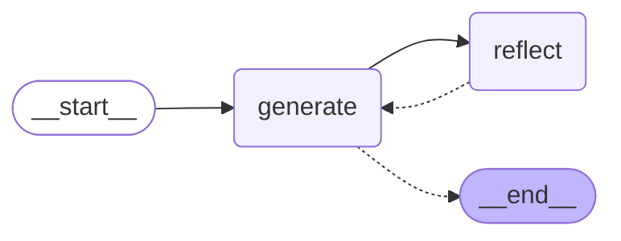

# 18. Reflection Agent — Iterative Self-Improvement with LangGraph

> **Context:** A reflection agent that iteratively improves a tweet by cycling between generation and critique — demonstrating the simplest useful LangGraph pattern beyond basic ReAct.

---

## Table of Contents

| # | Section | What You'll Learn |
|---|---------|-------------------|
| 1 | [What Is a Reflection Agent?](#1-what-is-a-reflection-agent) | The concept: generate → critique → revise → repeat |
| 2 | [Why Reflection Works](#2-why-reflection-works) | Self-refinement improves LLM output quality dramatically |
| 3 | [Architecture Overview](#3-architecture-overview) | Two nodes, one cycle, one stop condition |
| 4 | [The Graph Structure](#4-the-graph-structure) | Nodes, edges, state, and the conditional exit |
| 5 | [The Prompt Design Trick](#5-the-prompt-design-trick) | Why critique is wrapped in HumanMessage |
| 6 | [Code Walkthrough](#6-code-walkthrough) | Step-by-step through chains.py and main.py |
| 7 | [How It Differs From ReAct](#7-how-it-differs-from-react) | No tools, no function calling — pure LLM-to-LLM feedback |
| 8 | [Interview Q&A Anchors](#interview-qa-anchors) | Quick-fire answers |

---

## Key Definitions

| Term | Quick Recall | Full Definition |
|------|-------------|----------------|
| **Reflection Agent** | Generate → critique → revise loop | An agent architecture where one LLM call produces output, another critiques it, and the critique feeds back to produce a better version — iterating until a stop condition is met. |
| **Self-Reflection** | LLM evaluating its own work | The pattern of prompting an LLM to assess the quality of a previous LLM output, producing actionable feedback. |
| **Generate Node** | The writer | A graph node that produces or revises content based on the conversation history. |
| **Reflect Node** | The critic | A graph node that evaluates the latest draft and produces detailed feedback. |
| **Iteration Count** | Message length as stop signal | Using the number of accumulated messages to determine when to stop the loop (e.g., >6 messages ≈ 3 cycles). |

---

## 1. What Is a Reflection Agent?

A reflection agent uses **two LLM personas** in a feedback loop:

1. **Generator** — writes or revises content
2. **Reflector** — critiques the output and suggests improvements

The output of the reflector feeds back into the generator, creating iterative refinement:

```
┌───────────────────────────────────────────────────────┐
│              REFLECTION AGENT LOOP                     │
│                                                       │
│  User: "Make this tweet better: ..."                  │
│         │                                             │
│         ▼                                             │
│  ┌────────────┐         ┌────────────┐               │
│  │  GENERATE  │────────▶│  REFLECT   │               │
│  │  (writer)  │◀────────│  (critic)  │               │
│  └─────┬──────┘         └────────────┘               │
│        │                                              │
│        ▼  (after N iterations)                        │
│     [END] → Final polished tweet                      │
└───────────────────────────────────────────────────────┘
```

> **Key insight:** This is NOT a ReAct agent. There are no tools, no function calling. It's purely LLM-to-LLM feedback within a graph cycle.

---

## 2. Why Reflection Works

LLMs produce significantly better output when given a second chance with specific feedback. Research and practice show:

| Without Reflection | With Reflection |
|---|---|
| Single-shot generation | Iterative refinement |
| No quality awareness | Self-critical evaluation |
| Accepts first draft | Revises based on criteria |
| ~70% quality | ~90%+ quality after 2-3 cycles |

**Real-world analogy:** Writing a first draft vs. editing it three times. The editing cycles are where quality happens.

**Production use cases:**
- Tweet/content optimization (this project)
- Code generation → code review → revision
- Email drafting → tone check → revision
- Report writing → fact-checking → revision

Reference: [LangChain Blog — Reflection Agents](https://www.langchain.com/blog/reflection-agents)

---

## 3. Architecture Overview

The entire reflection agent is **less than 100 lines of code** because LangGraph handles the orchestration:

| Component | Implementation | Lines of Code |
|-----------|---------------|---------------|
| State | `MessageGraph` with `add_messages` reducer | 2 lines |
| Generate node | Invokes generation chain, returns AIMessage | 2 lines |
| Reflect node | Invokes reflection chain, wraps in HumanMessage | 3 lines |
| Stop condition | Check `len(state["messages"]) > 6` | 3 lines |
| Graph wiring | `add_node`, `add_edge`, `add_conditional_edges` | 4 lines |

**That's it.** LangGraph's graph compilation, state management, and execution loop handle everything else.

---

## 4. The Graph Structure

### Mermaid Diagram (project graph)



### ASCII Equivalent (for VS preview)

```
		┌─────────┐
		│  START  │
		└────┬────┘
			 │
			 ▼
	  ┌────────────┐
	  │  GENERATE  │◀─────────────────┐
	  └─────┬──────┘                  │
			│                         │
			▼                         │
	┌──────────────┐                  │
	│should_continue│                  │
	└───┬──────┬───┘                  │
		│      │                      │
   (>6 msgs)  (≤6 msgs)              │
		│      │                      │
		▼      ▼                      │
	 [END]  ┌─────────┐              │
			│ REFLECT  │──────────────┘
			└──────────┘
```

### State

```python
class MessageGraph(TypedDict):
	messages: Annotated[list[BaseMessage], add_messages]
```

- Uses `add_messages` reducer → messages APPEND (never replace)
- After 3 full cycles, the state has ~7 messages:
  1. Original HumanMessage (user's tweet)
  2. AIMessage (first draft)
  3. HumanMessage (first critique — wrapped!)
  4. AIMessage (revision 1)
  5. HumanMessage (second critique — wrapped!)
  6. AIMessage (revision 2)
  7. HumanMessage (third critique — wrapped!)
  8. → Stop! len > 6, route to END

### Edges

| From | To | Type | Condition |
|------|-----|------|-----------|
| START | GENERATE | Fixed edge | Always |
| GENERATE | REFLECT or END | Conditional | `len(messages) > 6` → END, else → REFLECT |
| REFLECT | GENERATE | Fixed edge | Always (the cycle!) |

---

## 5. The Prompt Design Trick

The most subtle part of this agent: **the reflect node wraps its output in a `HumanMessage`**.

```python
def reflection_node(state: MessageGraph):
	res = reflect_chain.invoke({"messages": state["messages"]})
	# ↓ THIS IS THE TRICK: wrap AI critique as a "human" message
	return {"messages": [HumanMessage(content=res.content)]}
```

**Why?** When the generate chain sees the conversation next time:
- HumanMessage = "feedback from the user" (the critique)
- AIMessage = "my previous response" (the draft)

If we left the critique as an AIMessage, the generator would see TWO consecutive AI messages and get confused about whose turn it is. By wrapping critique as HumanMessage, the conversation looks like a natural back-and-forth:

```
Human: "Make this tweet better..."     ← original request
AI:    "Here's my draft..."            ← first generation
Human: "Your tweet lacks hooks..."     ← critique (actually from reflect LLM!)
AI:    "Here's my revised draft..."    ← second generation
Human: "Better, but still too long..." ← another critique
AI:    "Final version..."              ← final generation
```

The generator thinks a human is giving it feedback. It's actually the reflector LLM.

---

## 6. Code Walkthrough

### `chains.py` — The Two LLM Chains

| Chain | System Prompt Role | Input | Output |
|-------|-------------------|-------|--------|
| `generate_chain` | "Twitter techie influencer assistant" | All messages | AIMessage (tweet draft) |
| `reflect_chain` | "Viral Twitter influencer grading a tweet" | All messages | AIMessage (critique) |

Both chains use `MessagesPlaceholder` to inject the full conversation history, giving them context about all prior drafts and feedback.

### `main.py` — The Graph

**Execution flow for one invocation:**

```
Step 1: User sends tweet → state: [HumanMessage]
Step 2: GENERATE runs → state: [HumanMessage, AIMessage(draft1)]
Step 3: should_continue → 2 msgs ≤ 6 → route to REFLECT
Step 4: REFLECT runs → state: [..., HumanMessage(critique1)]
Step 5: GENERATE runs → state: [..., AIMessage(draft2)]
Step 6: should_continue → 4 msgs ≤ 6 → route to REFLECT
Step 7: REFLECT runs → state: [..., HumanMessage(critique2)]
Step 8: GENERATE runs → state: [..., AIMessage(draft3)]
Step 9: should_continue → 6 msgs ≤ 6 → route to REFLECT
Step 10: REFLECT runs → state: [..., HumanMessage(critique3)]
Step 11: GENERATE runs → state: [..., AIMessage(draft4)]  ← 8 messages
Step 12: should_continue → 8 msgs > 6 → route to END ✅
```

The final tweet is the last AIMessage in the state.

---

## 7. How It Differs From ReAct

| Aspect | ReAct Agent (Section 13) | Reflection Agent (Section 14) |
|--------|--------------------------|-------------------------------|
| **Tools** | Yes (TavilySearch, triple) | None |
| **Function calling** | Yes (LLM requests tools) | No |
| **Stop condition** | LLM decides (no more tool_calls) | Developer decides (message count) |
| **Cycle purpose** | Gather information iteratively | Improve quality iteratively |
| **Node types** | Agent + ToolNode | Generate + Reflect (both pure LLM) |
| **State grows with** | Tool results (new information) | Critiques (quality feedback) |
| **LLM role** | Reasoning + acting | Writing + self-critiquing |

**The shared principle:** Both use LangGraph cycles. The LLM doesn't loop itself — the graph structure forces the iteration pattern.

---

## Interview Q&A Anchors

**Q: What is a reflection agent?**
> **A:** A reflection agent is an architecture where one LLM call generates output and another critiques it, feeding the critique back as input for revision. The cycle repeats for N iterations, progressively improving quality. It uses no tools — just LLM-to-LLM feedback within a graph loop.

**Q: How does the reflection agent know when to stop?**
> **A:** Unlike ReAct agents where the LLM decides (by not requesting tools), reflection agents typically use a developer-defined stop condition — in this case, message count exceeding a threshold. This is more predictable and prevents infinite refinement loops.

**Q: Why is the critique wrapped in a HumanMessage?**
> **A:** To maintain a natural conversation flow for the generator. If the critique were an AIMessage, the generator would see two consecutive AI messages and lose track of the dialogue structure. By wrapping it as HumanMessage, the generator treats it as "user feedback" and naturally produces a revision.

**Q: What's the difference between reflection and ReAct?**
> **A:** ReAct uses tools to gather external information (search, compute, APIs). Reflection uses no tools at all — it's purely internal LLM self-improvement. ReAct stops when the LLM has enough info; reflection stops after a fixed number of iterations. Both use LangGraph cycles, but for different purposes.

**Q: When would you use a reflection agent in production?**
> **A:** Content generation (tweets, emails, reports), code generation with self-review, translation quality improvement, or any task where iterative refinement produces measurably better output. It's cheap (just extra LLM calls, no external APIs) and dramatically improves quality.

---

## Runnable Script

→ [`src/main.py`](./src/main.py)

---

## References

- [LangChain Blog — Reflection Agents](https://www.langchain.com/blog/reflection-agents) — The reference blog post
- [LangGraph Documentation](https://langchain-ai.github.io/langgraph/) — Official docs
- [Reflexion Paper (Shinn et al., 2023)](https://arxiv.org/abs/2303.11366) — Academic foundation for reflection in LLM agents
