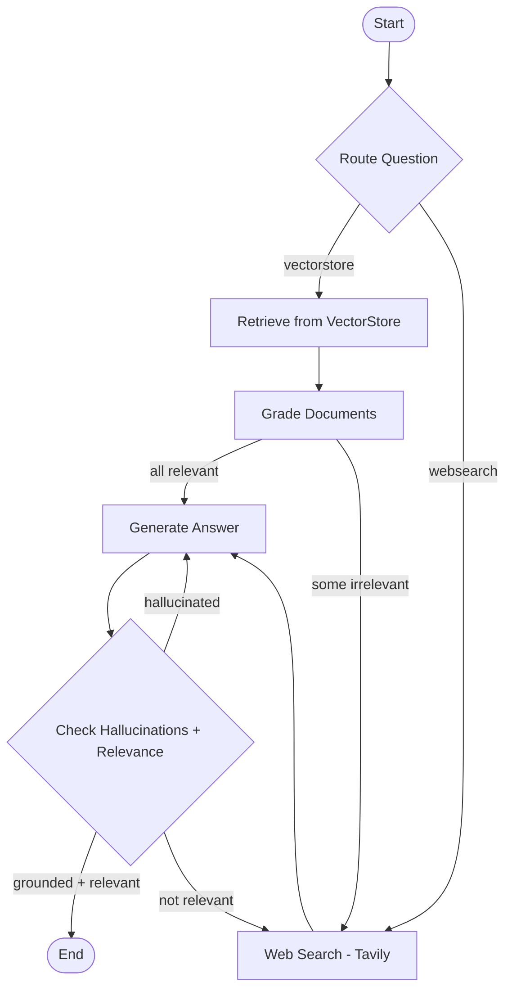

# 20. Agentic RAG — Adaptive Retrieval with Self-Correction

> **Context:** An Agentic RAG system that combines intelligent routing, document grading, hallucination detection, and web search fallback into a single LangGraph workflow. This is the evolution from deterministic RAG (Section 9) to a self-correcting, adaptive system.

---

## The Core Idea

> **Remember this, forget the rest.** Deterministic RAG retrieves and hopes for the best. Agentic RAG retrieves, checks if what it retrieved is useful, generates, checks if it hallucinated, checks if the answer is relevant, and falls back to web search if anything fails.

**The technique in one sentence:**

> "Retrieve → Grade → Generate → Verify → Self-correct or fall back to web search."

**The three RAG evolution levels:**

```
Level 1 — Deterministic RAG (Section 9):
  Question → Retrieve → Generate → Done
  (No checking. No fallback. Hope for the best.)

Level 2 — Self-RAG (this section):
  Question → Retrieve → Grade docs → Generate → Check hallucination → Check relevance
  (Catches bad retrievals and hallucinated answers. Retries generation.)

Level 3 — Adaptive RAG (this section):
  Route question → {vectorstore OR web search} → Grade → Generate → Verify
  (Doesn't even TRY vectorstore if the question is off-topic. Routes intelligently.)
```

**This project implements BOTH Self-RAG and Adaptive RAG in one graph.**

**RAG vs Agentic RAG — the difference:**

| | Deterministic RAG (Section 9) | Agentic RAG (this section) |
|--|------|------|
| **Routing** | Always goes to vectorstore | LLM decides: vectorstore OR web search |
| **Document quality** | Trusts whatever is retrieved | Grades each document for relevance |
| **Hallucination check** | None | Verifies generation is grounded in documents |
| **Answer relevance** | None | Checks answer actually addresses the question |
| **Fallback** | None — if retrieval fails, answer is garbage | Falls back to web search |
| **Self-correction** | None | Regenerates if hallucination detected |
| **Cost** | 1 LLM call | 4-6 LLM calls (router + grading + generation + verification) |
| **When to use** | High-quality corpus, simple questions | Mixed corpus, complex questions, high stakes |

**The concept vs the implementation:**

| The CONCEPT (remember this) | The IMPLEMENTATION (AI writes this) |
|-----------------------------|-------------------------------------|
| Route: is this a vectorstore question or web question? | `RouteQuery` Pydantic model + `with_structured_output` |
| Grade: is each retrieved document relevant? | `GradeDocuments` chain, loops through docs |
| Generate: answer the question from documents | `rlm/rag-prompt` from LangChain Hub |
| Check hallucination: is the answer grounded in docs? | `GradeHallucinations` chain |
| Check relevance: does the answer address the question? | `GradeAnswer` chain |
| Fall back: if docs are bad, search the web | Tavily web search node |

---

## Table of Contents

| # | Section | What You'll Learn |
|---|---------|-------------------|
| 1 | [What Is Agentic RAG?](#1-what-is-agentic-rag) | The three levels of RAG sophistication |
| 2 | [Architecture Overview](#2-architecture-overview) | Four nodes, conditional edges, self-correction loop |
| 3 | [The Five LLM Chains](#3-the-five-llm-chains) | Router, retrieval grader, generation, hallucination grader, answer grader |
| 4 | [The Graph — Node by Node](#4-the-graph--node-by-node) | What each node does, inputs, outputs |
| 5 | [The Conditional Edges — Decision Logic](#5-the-conditional-edges--decision-logic) | How the graph decides what to do next |
| 6 | [Ingestion Pipeline](#6-ingestion-pipeline) | ChromaDB, WebBaseLoader, tiktoken chunking |
| 7 | [Testing Strategy](#7-testing-strategy) | Why test each chain independently before the graph |
| 8 | [Code Walkthrough](#8-code-walkthrough) | File-by-file through the project |
| 9 | [Comparison: Deterministic RAG vs Self-RAG vs Adaptive RAG](#9-comparison-deterministic-rag-vs-self-rag-vs-adaptive-rag) | Side-by-side matrix |
| 10 | [Production Considerations](#10-production-considerations) | Cost, latency, guardrails, infinite loops |
| 11 | [Interview Q&A Anchors](#interview-qa-anchors) | Quick-fire answers |

---

## Key Definitions

| Term | Quick Recall | Full Definition |
|------|-------------|----------------|
| **Agentic RAG** | RAG + routing + grading + self-correction | A RAG system where an LLM makes decisions about retrieval strategy, document quality, and answer validity — not just retrieve-and-generate. |
| **Self-RAG** | Generate → check hallucination → check relevance | After generating, the system verifies the answer is grounded and relevant before returning it. |
| **Adaptive RAG** | Route question before retrieval | An LLM decides whether to use vectorstore or web search BEFORE retrieval begins. |
| **Retrieval Grader** | "Is this document relevant?" | An LLM chain that scores each retrieved document as "yes" or "no" for relevance to the question. |
| **Hallucination Grader** | "Is this answer grounded in the docs?" | An LLM chain that checks whether the generated answer is supported by the retrieved documents. |
| **Answer Grader** | "Does this answer the question?" | An LLM chain that checks whether the generation actually addresses what the user asked. |
| **Router** | "Vectorstore or web search?" | An LLM chain that classifies the question and decides the retrieval strategy. |
| **ChromaDB** | Local vector store | An open-source embedding database used for local development (vs Pinecone for cloud). |
| **Conditional Entry Point** | Graph starts at different nodes | `set_conditional_entry_point` lets the graph begin at different nodes based on the router's decision. |
| **with_structured_output** | Force LLM to return Pydantic model | Similar to `tool_choice` but cleaner — directly returns a Pydantic instance, no tool_calls wrapper. |

---

## 1. What Is Agentic RAG?

Standard RAG (Section 9) is a **linear pipeline**: embed → retrieve → stuff into prompt → generate. It's simple and cheap but has three failure modes:

1. **Irrelevant retrieval** — the vector search returns documents that don't actually answer the question
2. **Hallucination** — the LLM ignores the documents and makes up an answer
3. **Off-topic** — the question isn't even about what's in your corpus

Agentic RAG adds **decision-making** at each step:

```
┌──────────────────────────────────────────────────────────────────┐
│ AGENTIC RAG = RAG + these 4 "guards"                             │
│                                                                  │
│ Guard 1: ROUTER         — Is this even a vectorstore question?   │
│ Guard 2: DOC GRADER     — Are the retrieved docs actually useful?│
│ Guard 3: HALLUCINATION  — Is the answer grounded in real docs?   │
│ Guard 4: ANSWER GRADER  — Does the answer address the question?  │
│                                                                  │
│ If any guard fails → take corrective action (web search, retry)  │
└──────────────────────────────────────────────────────────────────┘
```

---

## 2. Architecture Overview

### Mermaid Diagram



### ASCII Equivalent

```
					┌─────────────┐
					│   START     │
					└──────┬──────┘
						   │
					┌──────▼──────┐
					│   ROUTER    │ (LLM decides)
					└──┬──────┬───┘
					   │      │
			vectorstore│      │websearch
					   │      │
				┌──────▼──┐   │
				│ RETRIEVE │   │
				└──────┬───┘   │
					   │       │
				┌──────▼──────┐│
				│ GRADE DOCS  ││
				└──┬──────┬───┘│
				   │      │    │
		   relevant│      │not │
				   │      │    │
				   │  ┌───▼────▼───┐
				   │  │ WEB SEARCH  │
				   │  └──────┬──────┘
				   │         │
				┌──▼─────────▼──┐
				│   GENERATE    │◄─── (retry if hallucinated)
				└───────┬───────┘
						│
				┌───────▼───────┐
				│ HALLUCINATION │
				│  + RELEVANCE  │
				└──┬─────┬──┬───┘
				   │     │  │
			useful │     │  │ not useful
				   │     │  │
			┌──────▼──┐  │  └──▶ WEB SEARCH (re-enter)
			│   END   │  │
			└─────────┘  │
						 │ not supported (hallucinated)
						 └──▶ GENERATE (retry)
```

---

## 3. The Five LLM Chains

Each "guard" is an independent LCEL chain that can be tested in isolation:

### 3.1 Router Chain

**Purpose:** Decide if the question should go to vectorstore or web search.

```python
class RouteQuery(BaseModel):
	datasource: Literal["vectorstore", "websearch"]

question_router = route_prompt | llm.with_structured_output(RouteQuery)
```

**Prompt logic:** "The vectorstore has docs about agents, prompt engineering, and adversarial attacks. Use it for those. Everything else → web search."

### 3.2 Retrieval Grader

**Purpose:** For each retrieved document, decide if it's relevant to the question.

```python
class GradeDocuments(BaseModel):
	binary_score: str  # "yes" or "no"

retrieval_grader = grade_prompt | llm.with_structured_output(GradeDocuments)
```

**Key:** Returns `str` ("yes"/"no"), not `bool`. The grade_documents node loops through ALL retrieved docs and filters out irrelevant ones.

### 3.3 Generation Chain

**Purpose:** Given documents + question, generate an answer.

```python
prompt = hub.pull("rlm/rag-prompt")  # Standard RAG prompt from LangChain Hub
generation_chain = prompt | llm | StrOutputParser()
```

**Note:** This is the only chain that returns freeform text (not structured output). It's a standard RAG generation — nothing fancy.

### 3.4 Hallucination Grader

**Purpose:** Is the generated answer actually supported by the documents?

```python
class GradeHallucinations(BaseModel):
	binary_score: bool  # True = grounded, False = hallucinated

hallucination_grader = hallucination_prompt | llm.with_structured_output(GradeHallucinations)
```

**Key:** Returns `bool`. `True` = the answer IS grounded in the facts. `False` = the LLM made stuff up.

### 3.5 Answer Grader

**Purpose:** Does the answer actually address the user's question?

```python
class GradeAnswer(BaseModel):
	binary_score: bool  # True = addresses question, False = doesn't

answer_grader = answer_prompt | llm.with_structured_output(GradeAnswer)
```

**Key:** This catches the case where the answer is factually correct (grounded in docs) but doesn't actually answer what was asked.

### Pattern: `with_structured_output` vs `tool_choice`

| Approach | Returns | Wrapper? | Use When |
|----------|---------|----------|----------|
| `llm.with_structured_output(Model)` | Pydantic instance directly | No (clean) | Binary decisions, classification |
| `llm.bind_tools([Model], tool_choice="Model")` | `AIMessage` with `tool_calls` | Yes (wrapped) | When you need ToolNode routing |

We use `with_structured_output` here because we don't need ToolNode — we just need a yes/no decision.

---

## 4. The Graph — Node by Node

| Node | Function | What It Does | Returns |
|------|----------|-------------|---------|
| `retrieve` | `retrieve(state)` | Queries ChromaDB with the question | `{documents, question}` |
| `grade_documents` | `grade_documents(state)` | Loops through docs, grades each one, filters irrelevant | `{documents (filtered), question, web_search: bool}` |
| `generate` | `generate(state)` | Passes docs + question to generation chain | `{documents, question, generation}` |
| `websearch` | `web_search(state)` | Queries Tavily, appends results to documents | `{documents (with web results), question}` |

**Key insight:** There is NO separate "hallucination check" node. The hallucination + answer grading logic lives in a **conditional edge function**, not a node. The graph calls `grade_generation_grounded_in_documents_and_question()` as a routing function after GENERATE.

---

## 5. The Conditional Edges — Decision Logic

### Entry Point: `route_question`

```python
workflow.set_conditional_entry_point(
	route_question,        # LLM classifies the question
	{
		WEBSEARCH: WEBSEARCH,   # Off-topic → straight to web search
		RETRIEVE: RETRIEVE,     # On-topic → vectorstore
	},
)
```

**This is Adaptive RAG** — the graph doesn't always start at the same node.

### After Grade Documents: `decide_to_generate`

```python
def decide_to_generate(state: GraphState) -> str:
	if state["web_search"]:   # Any doc was irrelevant
		return WEBSEARCH      # Supplement with web search
	else:
		return GENERATE       # All docs are good, generate
```

### After Generate: `grade_generation_grounded_in_documents_and_question`

This is the **Self-RAG** logic — a two-step check:

```python
def grade_generation_grounded_in_documents_and_question(state: GraphState) -> str:
	# Step 1: Is the answer grounded in documents? (hallucination check)
	score = hallucination_grader.invoke({...})
	if not score.binary_score:
		return "not supported"  # → REGENERATE (try again)

	# Step 2: Does the answer address the question? (relevance check)
	score = answer_grader.invoke({...})
	if score.binary_score:
		return "useful"         # → END (success!)
	else:
		return "not useful"     # → WEB SEARCH (need more info)
```

**Three possible outcomes after generation:**

| Outcome | Meaning | Action |
|---------|---------|--------|
| `"useful"` | Grounded + relevant | → END ✅ |
| `"not supported"` | Hallucinated (not grounded in docs) | → GENERATE (retry) |
| `"not useful"` | Grounded but doesn't answer the question | → WEBSEARCH (need different info) |

---

## 6. Ingestion Pipeline

### What Gets Ingested

Three blog posts from [Lilian Weng](https://lilianweng.github.io/):

| URL | Topic |
|-----|-------|
| `posts/2023-06-23-agent/` | LLM-powered autonomous agents |
| `posts/2023-03-15-prompt-engineering/` | Prompt engineering techniques |
| `posts/2023-10-25-adv-attack-llm/` | Adversarial attacks on LLMs |

### The Pipeline

```python
# 1. Load web pages
docs = [WebBaseLoader(url).load() for url in urls]

# 2. Split into chunks (tiktoken-based, 250 tokens each)
text_splitter = RecursiveCharacterTextSplitter.from_tiktoken_encoder(
	chunk_size=250, chunk_overlap=0
)
doc_splits = text_splitter.split_documents(docs_list)

# 3. Embed and store in ChromaDB
Chroma.from_documents(
	documents=doc_splits,
	collection_name="rag-chroma",
	embedding=OpenAIEmbeddings(),
	persist_directory="./.chroma",
)
```

### ChromaDB vs Pinecone (Section 9)

| | ChromaDB (this section) | Pinecone (Section 9) |
|--|-----------|---------|
| **Type** | Local (runs in-process) | Cloud (managed service) |
| **Persistence** | Disk (`.chroma/` folder) | Cloud-managed |
| **Setup** | Zero config | API key + index creation |
| **Best for** | Development, tutorials, single-machine | Production, multi-user, scaling |
| **Cost** | Free | Free tier → paid at scale |

> ⚠️ **Note:** ChromaDB is used here for simplicity. In production, you'd likely use Pinecone or a managed vector DB. The retriever interface is identical — only the initialization changes.

---

## 7. Testing Strategy

Test **each chain independently** before testing the full graph. This is a production best practice:

```
Test each chain in isolation:
  ✓ Router routes "agent memory" → vectorstore
  ✓ Router routes "how to make pizza" → websearch
  ✓ Retrieval grader says relevant doc → "yes"
  ✓ Retrieval grader says irrelevant doc → "no"
  ✓ Hallucination grader catches made-up content → False
  ✓ Hallucination grader passes grounded content → True
  ✓ Generation chain produces non-empty output

Only THEN test the full graph end-to-end.
```

**Why this matters:** If the full graph fails, you know exactly which chain broke. Without unit tests, debugging a 6-chain graph is a nightmare.

```bash
# Run chain tests
uv run pytest 16-agentic-rag/src/graph/chains/tests/test_chains.py -s -v
```

---

## 8. Code Walkthrough

### File Structure

```
16-agentic-rag/
├── 20_Agentic_RAG.md              # This theory file
├── 21_Agentic_RAG_Implementation.md  # Implementation walkthrough
└── src/
	├── main.py                    # Entry point — runs the graph
	├── ingestion.py               # ChromaDB ingestion pipeline
	└── graph/
		├── __init__.py
		├── consts.py              # Node name constants
		├── state.py               # GraphState TypedDict
		├── graph.py               # Graph definition + conditional edges
		├── chains/
		│   ├── __init__.py
		│   ├── router.py          # RouteQuery chain
		│   ├── retrieval_grader.py # Document relevance grader
		│   ├── hallucination_grader.py # Hallucination detection
		│   ├── answer_grader.py   # Answer relevance grader
		│   ├── generation.py      # RAG generation chain
		│   └── tests/
		│       ├── __init__.py
		│       └── test_chains.py # Unit tests for all chains
		└── nodes/
			├── __init__.py
			├── retrieve.py        # Vectorstore retrieval node
			├── grade_documents.py # Document grading + filtering node
			├── generate.py        # Answer generation node
			└── web_search.py      # Tavily web search node
```

### Data Flow

```
State = {question, generation, web_search, documents}

route_question(state) → decides entry node

retrieve:         question → [docs from ChromaDB]
grade_documents:  [docs] → [filtered docs] + web_search flag
web_search:       question → [docs + web results]
generate:         [docs] + question → generation (string)

Conditional: hallucination_grader + answer_grader → "useful" | "not supported" | "not useful"
```

---

## 9. Comparison: Deterministic RAG vs Self-RAG vs Adaptive RAG

| Aspect | Deterministic RAG | Self-RAG | Adaptive RAG (this project) |
|--------|-------------------|----------|---------------------------|
| **Entry** | Always retrieve | Always retrieve | Router decides (vectorstore or web) |
| **Doc quality** | Trust everything | Trust everything | Grade each document |
| **Hallucination** | No check | ✅ Check after generation | ✅ Check after generation |
| **Answer relevance** | No check | ✅ Check after generation | ✅ Check after generation |
| **Fallback** | None | Regenerate | Web search + regenerate |
| **LLM calls** | 1 | 3+ (gen + hallucination + answer) | 4-6 (router + grading + gen + checks) |
| **Cost** | $0.01/query | $0.03-0.05/query | $0.05-0.10/query |
| **Latency** | 1-2s | 3-5s | 5-10s |
| **Best for** | Simple FAQ, clean corpus | Medium stakes, decent corpus | High stakes, mixed corpus, production |

---

## 10. Production Considerations

### Infinite Loop Prevention

The current implementation has a **potential infinite loop**: if generation always hallucinates, it routes back to GENERATE forever.

**Production fix:** Add a retry counter to state:

```python
class GraphState(TypedDict):
	question: str
	generation: str
	web_search: bool
	documents: List[str]
	generation_attempts: int  # ← Add this

def grade_generation_grounded_in_documents_and_question(state: GraphState) -> str:
	if state.get("generation_attempts", 0) >= 3:
		return "useful"  # Give up after 3 attempts, return best effort
	# ... rest of logic
```

### Cost Optimization

| Technique | Savings |
|-----------|---------|
| Use `gpt-4o-mini` for grading chains (router, hallucination, answer) | 10-20x cheaper than gpt-4o |
| Cache router decisions for repeated questions | Eliminates 1 LLM call |
| Batch document grading (one call for all docs) | Reduces from N calls to 1 |
| Skip hallucination check for web search results | Web results are already factual |

### Latency Optimization

| Technique | Improvement |
|-----------|-------------|
| Grade documents in parallel (not sequentially) | 3-4x faster for doc grading |
| Stream generation while grading runs | Better UX |
| Use async ChromaDB client | Non-blocking retrieval |

### When NOT to Use Agentic RAG

- Simple FAQ chatbot with clean, curated corpus → Deterministic RAG is fine
- Cost-sensitive applications → Extra LLM calls add up
- Low-latency requirements (< 2s) → Multiple LLM round-trips are too slow
- Simple questions with guaranteed relevance → Grading adds unnecessary cost

---

## Interview Q&A Anchors

**Q: What is Agentic RAG and how does it differ from standard RAG?**
> **A:** Agentic RAG adds decision-making to the retrieval pipeline. Instead of blindly retrieve-and-generate, it routes questions intelligently (vectorstore vs web), grades retrieved documents for relevance, checks generation for hallucinations, and verifies the answer addresses the question. If any check fails, it takes corrective action — falling back to web search or regenerating. It's 4-6 LLM calls instead of 1, trading cost/latency for answer quality.

**Q: What's the difference between Self-RAG and Adaptive RAG?**
> **A:** Self-RAG adds post-generation verification: after generating an answer, it checks for hallucination (is the answer grounded in docs?) and relevance (does it address the question?). Adaptive RAG adds pre-retrieval routing: an LLM decides whether to use the vectorstore or web search BEFORE retrieval begins. This project combines both — adaptive routing at entry + self-correction after generation.

**Q: How do you prevent infinite loops in a Self-RAG system?**
> **A:** Add a generation attempt counter to the state. If the hallucination check keeps failing and sending back to GENERATE, cap it at 2-3 retries and return the best effort. Without this guard, a difficult question could loop forever, burning API credits and never returning. In production, also add timeouts and dead-letter queues.

**Q: Why test each grading chain independently?**
> **A:** A 6-chain LangGraph workflow is hard to debug end-to-end. If the full graph returns wrong answers, you don't know which chain broke — the router, the retrieval grader, the hallucination grader, or the answer grader. Unit testing each chain in isolation means you can pinpoint failures immediately. It's the same principle as unit testing microservices before integration testing.

**Q: When would you use `with_structured_output` vs `tool_choice`?**
> **A:** Use `with_structured_output` when you need a clean Pydantic instance directly — binary decisions, classification, simple structured responses. Use `tool_choice` + `bind_tools` when you need the response to flow through `ToolNode` for execution (like the Reflexion agent). `with_structured_output` is simpler and returns the model directly; `tool_choice` wraps it in `AIMessage.tool_calls` for the LangGraph tool execution pipeline.

**Q: What are the three failure modes of standard RAG that Agentic RAG solves?**
> **A:** (1) Irrelevant retrieval — vector search returns documents that don't answer the question. Fixed by document grading + web search fallback. (2) Hallucination — LLM ignores documents and makes up facts. Fixed by hallucination grading + regeneration. (3) Off-topic questions — the question isn't about what's in the corpus. Fixed by intelligent routing to web search instead of wasting a vectorstore query.

**Q: Why use ChromaDB here instead of Pinecone?**
> **A:** ChromaDB runs locally with zero configuration — ideal for tutorials and development. Pinecone is a managed cloud service better for production (scaling, multi-user, no local storage). The retriever interface is identical in LangChain, so switching from ChromaDB to Pinecone requires changing only the initialization code, not the graph logic.

---

## Runnable Scripts

→ [`src/ingestion.py`](./src/ingestion.py) — Ingest web pages into ChromaDB (run once)
→ [`src/main.py`](./src/main.py) — Run the full Agentic RAG graph
→ [`src/graph/chains/tests/test_chains.py`](./src/graph/chains/tests/test_chains.py) — Unit tests for all chains

---

## References

- [Reflexion Paper (Shinn et al., 2023)](https://arxiv.org/pdf/2303.11366) — Self-RAG concepts originated here
- [Self-RAG Paper (Asai et al., 2023)](https://arxiv.org/abs/2310.11511) — Original Self-RAG paper from University of Washington
- [Adaptive RAG Paper (Jeong et al., 2024)](https://arxiv.org/abs/2403.14403) — Adaptive retrieval strategies
- [Advance RAG control flow with Mistral and LangChain (YouTube)](https://www.youtube.com/watch?v=sgnrL7yo1TE) — Original video by Sophia Young (Mistral) & Lance Martin (LangChain)
- [LangChain Cookbook — Advanced RAG](https://github.com/mistralai/cookbook/tree/main/third_party/langchain) — Original Sophia Young + Lance Martin notebook
- [LangGraph Documentation](https://langchain-ai.github.io/langgraph/) — StateGraph, conditional edges, compilation
- [ChromaDB](https://www.trychroma.com/) — Open-source embedding database
- [Tavily Search](https://tavily.com/) — Search engine optimized for LLM applications
- [Lilian Weng's Blog](https://lilianweng.github.io/) — Source documents used for ingestion
