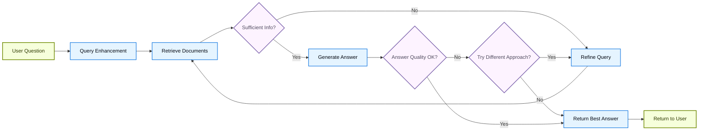

# RAG Architecture Decisions — A Production Guide

When to use Deterministic (2-Step) RAG, Agentic RAG, Conversational RAG, or Hybrid RAG. Official LangChain terminology mapping, cost analysis, memory strategies, and system prompt optimization.

*Cross-cutting reference — applies to any RAG system you build, not just one section.*

---

## 📑 Table of Contents

| # | Section | What You'll Learn |
|---|---------|-------------------|
| 1 | [The Four RAG Architectures](#the-three-rag-architectures) | Definitions, flow diagrams, official LangChain terminology mapping |
| 2 | [Cost Breakdown](#cost-breakdown--why-deterministic-is-cheaper) | Why "always retrieving" is actually cheaper |
| 3 | [Comparison Table](#the-full-comparison) | Side-by-side: all four approaches |
| 4 | [System Prompt Optimization](#reducing-tool-calls-via-system-prompt) | How to guide the agent to minimize cost |
| 5 | [Memory & History Management](#memory--history-management) | Token explosion, sliding windows, summarization |
| 6 | [Architecture Decision Guide](#architecture-decision-guide) | 7 questions to pick the right approach |
| 7 | [Interview Q&A](#interview-qa-anchors) | 8+ architecture-focused interview questions |

---

## The Three RAG Architectures

### 1. Deterministic RAG

**You** (the developer) define the steps. The LLM only generates an answer from the context you gave it. It has no choice, no tools, no decision-making.

```
User question
	↓
ALWAYS retrieve from vector store (hardcoded — no LLM decides this)
	↓
Stuff retrieved chunks into the prompt
	↓
LLM generates answer using those chunks
	↓
Answer
```

**One-liner:** Retriever always runs. 1 LLM call. 100% predictable.

### 2. Deterministic + Conversational RAG

Same fixed pipeline, but adds a **reformulation step** so follow-up questions work:

```
User question (might be a follow-up like "Tell me more")
	↓
LLM #1: Reformulates into a standalone question ("Explain LCEL chains in detail")
	↓
ALWAYS retrieve from vector store (still hardcoded)
	↓
LLM #2: Generates answer using retrieved chunks
	↓
Answer
```

**One-liner:** Reformulate → always retrieve → generate. 2 LLM calls. Still 100% predictable.

### 3. Agentic RAG

The **LLM decides** the steps. You give it tools and say "figure it out." It might retrieve zero times, once, or multiple times.

```
User question
	↓
LLM looks at the question and THINKS:
	"Do I need to search the docs for this?"
	↓
	├── YES → calls retrieve_context tool → gets chunks → reads them → answers
	├── YES × 2 → calls tool TWICE (e.g., compare two topics) → reads both → answers
	└── NO → answers directly from its own knowledge (no retrieval at all)
```

**One-liner:** LLM decides whether to retrieve. 2+ LLM calls. Unpredictable.

### 4. Hybrid RAG (Self-Correcting)

**The production standard.** This is what most companies actually deploy — it combines the predictability of 2-Step RAG with validation loops that catch bad retrievals and hallucinated answers before they reach the user.

#### Official Definition (from LangChain Docs)

> **Hybrid RAG** combines characteristics of both 2-Step and Agentic RAG. It introduces intermediate steps such as query preprocessing, retrieval validation, and post-generation checks. These systems offer more flexibility than fixed pipelines while maintaining some control over execution.
>
> Typical components include:
> - **Query enhancement**: Modify the input question to improve retrieval quality. This can involve rewriting unclear queries, generating multiple variations, or expanding queries with additional context.
> - **Retrieval validation**: Evaluate whether retrieved documents are relevant and sufficient. If not, the system may refine the query and retrieve again.
> - **Answer validation**: Check the generated answer for accuracy, completeness, and alignment with source content. If needed, the system can regenerate or revise the answer.
>
> The architecture often supports **multiple iterations** between these steps.
>
> — *[LangChain Retrieval Docs](https://docs.langchain.com/oss/python/langchain/retrieval)*

The key insight: in production, you can't trust that retrieval *always* finds the right chunks, and you can't trust that the LLM *always* generates grounded answers. Hybrid RAG adds **quality gates** — automated checks that retry or reroute when something goes wrong.

```
User question
	↓
Query Enhancement (rewrite vague queries for better retrieval)
	↓
Retrieve from vector store
	↓
Validate: Are these chunks actually relevant?
	├── NO → Refine query → Retrieve again (up to N retries)
	└── YES ↓
Generate answer
	↓
Validate: Is the answer grounded & complete?
	├── NO → Try different approach or return best effort
	└── YES → Return answer
```

**One-liner:** Retrieve → validate → generate → validate. Multiple LLM calls with quality gates.

### Hybrid RAG Flow Diagram (from LangChain Official Docs)



Key observations from this diagram:
- **Two validation gates** — one after retrieval, one after generation
- **Two retry loops** — refine query loops back to retrieval; bad answer loops back to query refinement
- **Graceful degradation** — if retries are exhausted, returns best effort rather than failing silently
- **All paths lead to a response** — the user always gets an answer (no dead ends)

### Hybrid RAG — The Three Core Components

According to LangChain's official documentation, Hybrid RAG introduces three intermediate steps that distinguish it from simpler architectures:

| Component | What It Does | Why It Matters |
|-----------|-------------|----------------|
| **Query Enhancement** | Modifies the input question to improve retrieval quality — rewrites unclear queries, generates multiple variations, or expands with additional context | Vague questions like "how does it work?" become precise searches like "how does the LangChain LCEL pipe operator compose runnables" |
| **Retrieval Validation** | Evaluates whether retrieved documents are relevant and sufficient. If not, refines the query and retrieves again | Catches the #1 RAG failure mode — retrieving irrelevant chunks that lead to hallucinated answers |
| **Answer Validation** | Checks the generated answer for accuracy, completeness, and alignment with source content. Can regenerate or revise | Prevents the #2 failure mode — LLM adding unsupported claims even when chunks were correct |

### Why Production Teams Choose Hybrid

Hybrid RAG is what's actually deployed across production systems in companies. Here's why:

| Problem in Production | How Hybrid Fixes It |
|----------------------|---------------------|
| Users ask vague questions ("how does it work?") | Query enhancement rewrites before retrieval |
| Retriever returns irrelevant chunks (wrong k, ambiguous query) | Retrieval validation detects and retries with refined query |
| LLM hallucinates despite having correct context | Answer validation catches unsupported claims |
| Different queries need different strategies | Conditional routing (web search vs vector store vs SQL) based on query type |
| Single retrieval isn't enough for complex questions | Iterative refinement loop until quality threshold is met |

### Hybrid RAG vs Simple Agentic RAG

| | Agentic RAG | Hybrid RAG |
|--|--|--|
| **Decision maker** | LLM decides everything freely | Developer designs the validation logic, LLM executes within it |
| **Quality guarantees** | None — hope the LLM does the right thing | Built-in — validators catch failures before user sees them |
| **Retry logic** | LLM might retry, might not | Codified — max N retries, with query refinement |
| **Cost predictability** | Low (LLM might loop forever) | Moderate (capped loops, known max iterations) |
| **Production readiness** | Risky without guardrails | Designed for production from the start |

### Implementation Pattern (LangGraph)

Hybrid RAG is where **LangGraph** (state machines) becomes necessary. You can't build reliable validation loops with simple LCEL chains — you need conditional edges, retry states, and capped iterations:

```
StateGraph:
  START → query_enhancement → retrieve → validate_retrieval
  validate_retrieval → (relevant) → generate → validate_answer
  validate_retrieval → (irrelevant) → refine_query → retrieve  [max 3 retries]
  validate_answer → (grounded) → END
  validate_answer → (hallucinated) → regenerate → validate_answer  [max 2 retries]
  validate_answer → (max retries) → return_best_effort → END
```

**C# Analogy:** This is a `StateMachine<TState>` with `IValidator<T>` checks at each transition — like a workflow engine (Elsa, Temporal) where each step can succeed, fail, or retry.

**When to use:** Ambiguous queries, domain-specific Q&A where wrong answers are costly (medical, legal, financial), systems that need measurable quality guarantees, any production system where "good enough" isn't acceptable.

> 🔗 **LangChain reference:** [Agentic RAG with Self-Correction (LangGraph tutorial)](https://docs.langchain.com/oss/python/langgraph/agentic-rag) — their official example of Hybrid RAG.

---

### Official LangChain Terminology Mapping

LangChain's official documentation (as of 2025) uses slightly different naming. When you read their docs or talk to interviewers who use their terms:

| Our Term (This Repo) | LangChain Official Term | Notes |
|---|---|---|
| **Deterministic RAG** | **2-Step RAG** | "Retrieval always happens before generation. Simple and predictable." |
| **Deterministic + Conversational** | **2-Step RAG** (with reformulation) | LangChain doesn't name this separately — it's still 2-step with a pre-processing chain |
| **Agentic RAG** | **Agentic RAG** | Same name. "An LLM-powered agent decides *when* and *how* to retrieve." |
| **Hybrid RAG** | **Hybrid RAG** | Combines both with validation steps. LangChain references LangGraph's "Agentic RAG with Self-Correction" tutorial for this. |

**Interview tip:** Use "2-Step RAG" when talking about LangChain specifically. Use "Deterministic RAG" when discussing architecture patterns generally — it's more descriptive of *why* you chose it.

> 📖 **Source:** [LangChain Retrieval Docs](https://docs.langchain.com/oss/python/langchain/retrieval) — the official comparison table and architecture descriptions.

---

### The C# Analogy

| Architecture | C# Equivalent |
|---|---|
| **Deterministic / 2-Step** | Calling `repository.Search(query)` directly in your controller — always executes |
| **Deterministic + Conversational** | Middleware normalizes the request, then always calls the same endpoint |
| **Agentic** | Handing a `Func<string, List<Document>>` to a decision engine that may or may not invoke it |
| **Hybrid** | A `while` loop with `IValidator` checks after each step — retry until `ValidationResult.IsValid` |

---

## Cost Breakdown — Why Deterministic Is Cheaper

"Always calling the retriever" sounds like more work. But **the retriever is almost free — it's the LLM that's expensive.**

```
DETERMINISTIC RAG:
  Embed the query         → OpenAI embedding API   ~$0.00002  (negligible)
  Search Pinecone         → Vector similarity      ~$0.00000  (free tier / pennies)
  Stuff chunks + generate → GPT-4o LLM call        ~$0.01-0.03
											Total:  1 LLM call

DETERMINISTIC + CONVERSATIONAL:
  Reformulate follow-up   → GPT-4o LLM call #1     ~$0.005    (small, focused task)
  Embed + Search          → Embedding + Pinecone   ~$0.00002  (negligible)
  Generate answer         → GPT-4o LLM call #2     ~$0.01-0.03
											Total:  2 LLM calls (always exactly 2)

AGENTIC RAG:
  LLM decides what to do  → GPT-4o LLM call #1     ~$0.01     (heavier — tool schemas + reasoning)
  Embed + Search          → Embedding + Pinecone   ~$0.00002  (negligible)
  Generate answer         → GPT-4o LLM call #2     ~$0.01-0.03
											Total:  2+ LLM calls (could be 3-4 for complex queries)
```

### Why Conversational and Agentic Both Use 2 Calls but Aren't Equal

| | Deterministic + Conversational | Agentic |
|--|--|--|
| **Call #1 does what?** | Reformulates the question (small, focused) | Decides whether to retrieve AND formulates the query (open-ended reasoning) |
| **Call #1 cost** | ~500 tokens (just rewriting a question) | ~1000+ tokens (system prompt + tool schemas + reasoning) |
| **Can it skip retrieval?** | ❌ No — retrieval always happens | ✅ Yes — LLM might decide it doesn't need docs |
| **Can it call tools multiple times?** | ❌ No — one retrieval per query | ✅ Yes — complex queries → 2+ tool calls |
| **Extra LLM calls possible?** | Never — always exactly 2 | Yes — "Compare X and Y" might trigger 3-4 calls |
| **Predictable cost?** | ✅ Always | ❌ Variable |

**The real cost difference is predictability.** Deterministic is always exactly N calls. Agentic can spiral.

---

## The Full Comparison

| Factor | Deterministic (2-Step) | Deterministic + Conversational | Agentic | Hybrid |
|--------|--------------|-------------------------------|---------|--------|
| **Who controls flow?** | Developer (hardcoded) | Developer (hardcoded) | LLM (decides) | Developer + LLM (validation gates) |
| **When to search** | Always | Always (after reformulation) | Agent decides | Always, with retry if bad |
| **LLM calls per query** | 1 | 2 (reformulate + generate) | 2+ (reasoning + generate, maybe more) | 3-5 (enhance + validate + generate + validate) |
| **Cost** | Lowest | Moderate (predictable) | High (unpredictable) | Highest (multiple validation calls) |
| **Latency** | Lowest | Moderate | Variable | Highest (loops) |
| **Follow-up support** | ❌ None | ✅ Full | ✅ Full (if you pass history) | ✅ Full |
| **Predictability** | 100% | 100% | Variable | Mostly predictable (capped loops) |
| **Off-topic handling** | Rigid (always answers from docs) | Rigid | Flexible (can refuse or answer generally) | Flexible (validator catches off-topic) |
| **Best for** | Single-question bots | Customer support with follow-ups | Multi-tool exploratory assistants | High-stakes domain Q&A (medical, legal, finance) |

---

## Reducing Tool Calls via System Prompt

You can guide an agent to be more efficient — but it's a suggestion, not a guarantee:

```python
# UNOPTIMIZED (LLM decides freely — may call tool 2-3 times):
system_prompt = "You are a helpful assistant that answers questions about LangChain."

# OPTIMIZED (guide toward fewer calls):
system_prompt = """You are a helpful assistant that answers questions about LangChain.

When using the retrieval tool:
- Use a SINGLE broad query that covers the full question rather than multiple narrow queries.
- For comparison questions like "Compare X and Y", search for "X vs Y" or "X and Y differences"
  in ONE call instead of searching X and Y separately.
- Only call the tool again if the first result clearly didn't contain what you need.
- If the retrieved context already answers the question, respond immediately — do not search again.
"""
```

### What Changes

| | Without Guidance | With Prompt Guidance |
|--|--|--|
| "Compare LangChain agents with LangGraph" | 2 tool calls (one per topic) | 1 tool call ("LangChain vs LangGraph agents") |
| "What is LCEL?" (general knowledge) | Might still call tool unnecessarily | More likely to answer directly |
| Cost per complex query | 3-4 LLM calls | 2 LLM calls |

### The Trade-off

| Fewer tool calls | More tool calls |
|---|---|
| ✅ Cheaper, faster | ✅ More thorough coverage |
| ❌ Broad query = less precise retrieval | ✅ Narrow queries = more precise chunks |
| Best for: cost-sensitive production | Best for: accuracy-critical research |

**Bottom line:** If you're fighting to prevent extra tool calls via the system prompt, ask whether deterministic RAG would've been the better architecture in the first place.

**C# Analogy:** This is like adding XML doc comments saying "please batch your database calls" — callers *should* follow it, but you can't enforce it at compile time. If you need enforcement, change the architecture.

---

## Memory & History Management

### The Problem: Token Explosion

If you pass full conversation history (including retrieved chunks) back to the agent:

```
After 5 questions with retrieval:
  Each tool call adds ~4 chunks × 4000 chars = ~16,000 chars per question
  5 questions × ~4000 tokens of tool content = ~20,000 tokens of stale context
  + system prompt + current question
  = Approaching context window limit, slow, expensive
```

This **defeats the purpose of RAG** — you're stuffing everything into the context window, which is exactly what RAG was designed to avoid.

### Production Solutions

| Strategy | How It Works | Trade-off |
|----------|-------------|-----------|
| **Sliding window** | Keep only last N message pairs, drop older ones | Loses early context |
| **Summarize older half** | LLM compresses messages 1-6 into a paragraph, keeps 7-11 exact | Extra LLM call per turn (~500 tokens) |
| **Strip ToolMessages** | Keep only Human + AI answers, drop tool content | Forces fresh retrieval (but that's RAG's job) |
| **Token budget** | Trim history to fit within a limit (e.g., 4000 tokens) | Predictable cost, partial context loss |

### The Recommended Approach: Strip + Sliding Window

```python
# Keep recent Q&A pairs, drop the bulky retrieved chunks
clean_history = [
	msg for msg in chat_history
	if msg["role"] in ("user", "assistant")  # drop ToolMessages
][-10:]  # keep last 10 messages
```

The LLM sees enough history for follow-ups, but never drowns in old chunks. If it needs context, it calls the tool again — which is exactly what RAG is designed for.

### Why Summarize Only the Older Half?

```
Before (11 messages, over budget):
  [msg1] [msg2] ... [msg6]  [msg7] [msg8] [msg9] [msg10] [msg11]
  ───── older, can compress ─────  ──── recent, keep exact ─────

After summarization:
  [Summary: "User asked about agents and streaming. Key findings: ..."]
  [msg7] [msg8] [msg9] [msg10] [msg11]
```

You don't summarize ALL messages because:
- Recent messages need exact wording for accurate follow-ups
- "Use Pinecone not Chroma" in msg 9 would become vague in a summary
- The extra LLM call (~500 tokens) costs far less than sending 20,000 tokens of stale content

**C# Analogy:** Like keeping a conversation log in `List<ChatMessage>` but only serializing the last N entries to the API, not the entire `DbContext` change history.

---

## Architecture Decision Guide

Ask these questions when designing a RAG system:

| Question | If Yes → | If No → |
|----------|----------|---------|
| Does the user ALWAYS need the knowledge base? | Deterministic / 2-Step RAG | Consider Agentic |
| Are there multiple tools (search + SQL + API)? | Agentic (LLM picks tool) | Deterministic (one tool, always called) |
| Is cost/latency critical? | Deterministic (1 LLM call) | Agentic OK (2+ calls acceptable) |
| Do you need conversation memory? | Add reformulation or summarization | Stateless per-request is fine |
| Is the use case open-ended/exploratory? | Agentic | Deterministic |
| Are wrong answers unacceptable (medical, legal)? | Hybrid (validation loops) | Deterministic or Agentic |
| Do you need measurable quality guarantees? | Hybrid (built-in eval gates) | Simpler architecture is fine |

### All Architecture Decisions at a Glance

| Decision | Options | Key Trade-off |
|----------|---------|---------------|
| Retrieval approach | Deterministic vs Agentic | Predictable cost vs flexible tool use |
| Follow-up handling | Reformulation vs agent history | Fixed pipeline vs LLM-driven context |
| Memory management | Sliding window vs summarization vs strip | Simplicity vs context preservation |
| System prompt guidance | Minimal vs constrained | LLM freedom vs cost control |
| Number of tools | Single retriever vs multi-tool | Simplicity vs capability |
| Embedding ownership | Pinecone Integrated vs Bring Your Own | Convenience vs control/cost |
| Vector store | Local (Chroma) vs Cloud (Pinecone) | Dev speed vs production reliability |

---

## Interview Q&A Anchors

**Q: What's the simplest way to explain deterministic vs agentic RAG?**

> **A:** Deterministic = **you** (the developer) define the steps — retrieve then generate, every time, no choice. Agentic = **the LLM** decides the steps — you give it tools and it figures out which ones to call and when. Deterministic is like calling `repository.Search()` directly in your controller. Agentic is like handing a `Func<>` to a decision engine that may or may not invoke it.

**Q: Deterministic RAG always retrieves — how is that cheaper than agentic?**

> **A:** The retriever (embed query + search vector store) costs ~$0.00002 — essentially free. The LLM call costs ~$0.01-0.03 — 1000× more. Deterministic makes 1 LLM call. Agentic makes at least 2 (one to reason, one to generate). The retriever running every time is like running a SQL query — it's fast and cheap. The extra LLM reasoning call is what costs money.

**Q: Conversational deterministic RAG also needs 2 LLM calls — so how is it still cheaper than agentic?**

> **A:** Both use 2 LLM calls, but they're not equal. Deterministic's first call is a small, focused reformulation (~500 tokens). Agentic's first call is open-ended reasoning with tool schemas and decision logic (~1000+ tokens). More importantly, deterministic is always exactly 2 calls. Agentic can spiral to 3-4 if the LLM calls the tool multiple times. The real cost difference is **predictability**, not the number of calls.

**Q: Can you reduce agentic RAG costs via the system prompt?**

> **A:** Yes — you can guide the LLM to use broader queries and minimize tool calls. But it's a suggestion, not a guarantee. The LLM might still make multiple calls if it thinks it needs more context. If you need guaranteed single retrieval, use deterministic RAG — that's the whole point of it. Optimizing the system prompt to prevent tool calls is a sign you might want a fixed pipeline instead.

**Q: If you add full conversation history to an agentic RAG system, what's the main risk?**

> **A:** Token explosion. Each tool call adds ~4 chunks of ~4000 chars to the history. After 5 questions, you're sending ~20,000 tokens of stale retrieved context with every request — slow, expensive, and approaching the context window limit. This defeats RAG's purpose. The solution is to strip ToolMessages from history and let the agent re-retrieve when needed.

**Q: What are the production options for conversation memory in RAG?**

> **A:** Three main approaches: (1) **Strip ToolMessages + sliding window** — keep only the last N Human/AI pairs, drop bulky tool content, force fresh retrieval. (2) **Summarize older half** — compress messages 1-6, keep 7-11 exact, so the LLM has context gist plus precise recent history. (3) **Question reformulation** — rewrite follow-ups as standalone queries so the retriever always gets a self-contained search.

**Q: When should you use agentic RAG vs deterministic with reformulation?**

> **A:** Use deterministic + reformulation when you have ONE knowledge base and every question should be answered from it (customer support, FAQ bots). Use agentic when you have MULTIPLE tools (search + SQL + calculator + API) and the LLM genuinely needs to decide which ones to use. If you're fighting to prevent extra tool calls, you probably want deterministic.

**Q: Why summarize only older history, not all of it?**

> **A:** Recent messages need exact wording for accurate follow-ups. If the user said "Use Pinecone not Chroma" two messages ago, a summary might lose that precision. Compressing only the older half preserves recent context exactly while still giving the LLM the gist of earlier conversation. The extra summarization call (~500 tokens) costs far less than sending all raw history.

**Q: What is Hybrid RAG and why do production teams use it?**

> **A:** Hybrid RAG adds validation loops to the retrieval-generation pipeline: query enhancement before retrieval, retrieval validation after search, and answer validation after generation. If any check fails, the system retries with a refined approach (up to a cap). Production teams use it because neither retrieval nor generation is reliable 100% of the time — users ask vague questions, retrievers return irrelevant chunks, and LLMs hallucinate even with correct context. Hybrid catches these failures before the user sees them.

**Q: What are the three components of Hybrid RAG?**

> **A:** (1) **Query enhancement** — rewrite vague questions into precise search queries before retrieval. (2) **Retrieval validation** — check if the retrieved chunks are actually relevant; if not, refine and re-retrieve. (3) **Answer validation** — check if the generated answer is grounded in the context and complete; if not, regenerate. Each component is an LLM call acting as a judge/validator.

**Q: Why can't you implement Hybrid RAG with simple LCEL chains?**

> **A:** LCEL chains are linear — data flows one direction through the pipe. Hybrid RAG requires conditional branching (retry or proceed?) and loops (refine query → re-retrieve → re-validate). This is where LangGraph's `StateGraph` becomes necessary — it models the workflow as a state machine with conditional edges, enabling cycles, retries, and capped iterations. In C# terms: LCEL is LINQ method chaining (linear), LangGraph is a workflow engine like Temporal or Elsa (branching, looping, state).

**Q: How does Hybrid RAG differ from just adding retry logic to Agentic RAG?**

> **A:** Agentic RAG trusts the LLM to self-correct — it *might* retry, or might not. Hybrid RAG codifies the validation externally: the developer defines what "relevant retrieval" means, what "grounded answer" means, and what happens on failure. The LLM operates *within* the developer's quality gates rather than deciding everything freely. It's the difference between hoping a developer writes tests vs enforcing a CI pipeline that blocks bad code.

---

## References

- [LangChain Retrieval Docs (Official RAG Architectures)](https://docs.langchain.com/oss/python/langchain/retrieval)
- [chat-langchain — LangChain's Production RAG Chatbot](https://github.com/langchain-ai/chat-langchain)
- [LangChain Agents — create_agent](https://python.langchain.com/docs/how_to/tool_calling_agent/)
- [LangChain Conversation Memory](https://python.langchain.com/docs/how_to/chatbots_memory/)
- [OpenAI Pricing](https://openai.com/pricing)
- [Pinecone Pricing](https://www.pinecone.io/pricing/)
- Section 9: [RAG Theory & Concepts](../09-gist-of-rag/09_RAG_Theory_And_Concepts.md)
- Section 10: [Doc Assistant Theory](../10-documentation-assistant/11_DocAssistant_Theory_And_Concepts.md)
